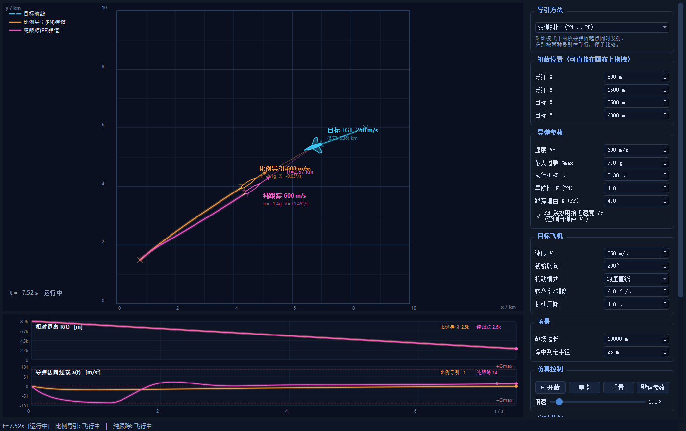
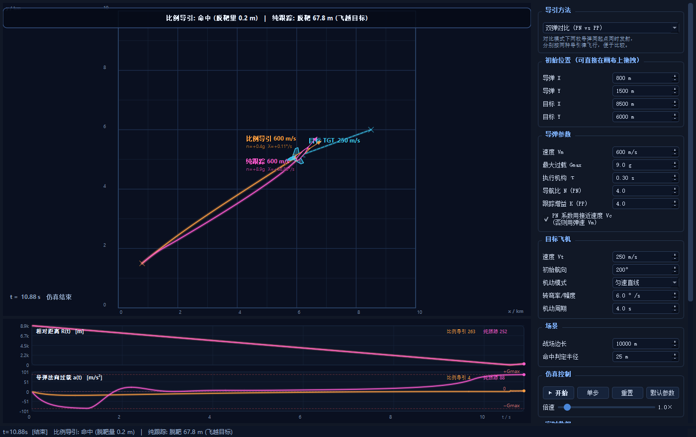
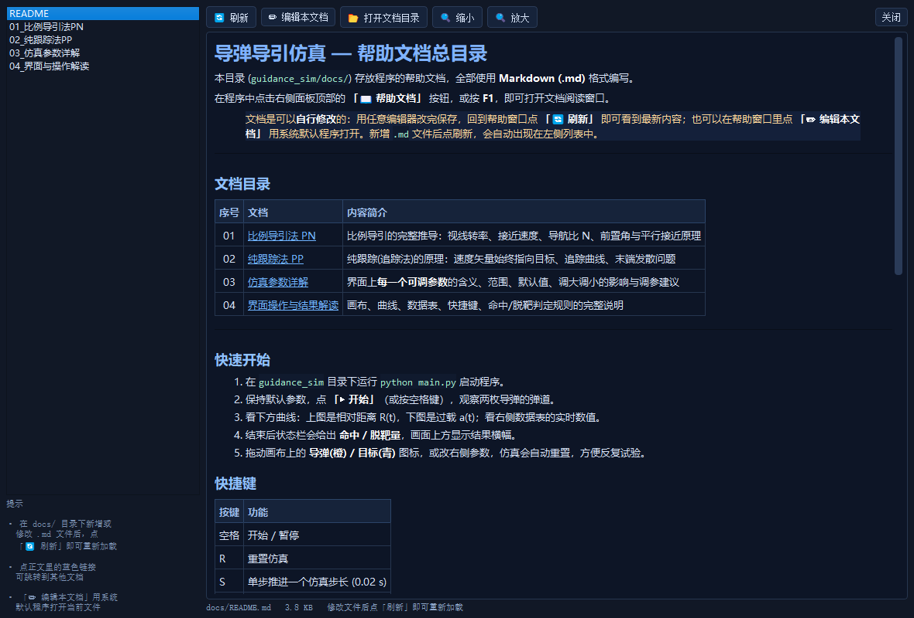

# 导弹导引仿真 —— 比例导引 (PN) vs 纯跟踪 (PP)

基于 **Python + PyQt5** 的二维平面导弹拦截仿真程序。可在画布上直接**拖拽导弹与目标飞机
的初始位置**，实时观察两种经典导引律的弹道、过载与脱靶量差异，并以“双弹对比”模式
同起点同时发射两枚导弹做定量对照。

---

## 1. 快速开始

```bash
cd guidance_sim
python main.py                 # 启动图形界面
```

依赖：Python 3.8+、PyQt5（仅用标准 QPainter 绘图，**无需** pyqtgraph/matplotlib）。

```bash
python selftest.py             # 无界面数值自检：跑 9 组场景，打印脱靶量
python gui_test.py             # GUI 集成测试：51 项信号/交互/文档断言
python main.py --snapshot out.png --seconds 10   # 自动截图后退出
```

### 界面预览

**飞行中**（橙色=比例导引弹道，品红=纯跟踪弹道，青色=目标航线）：



**交战结束**（顶部横幅给出两发的脱靶量）：



**帮助文档窗口**（F1 / 帮助按钮，Markdown 渲染，含算法推导与逐参数说明）：



### 界面操作

| 操作 | 说明 |
| --- | --- |
| **鼠标左键拖拽** | 画布上拖动导弹 / 目标飞机，修改初始位置（同步到右侧坐标框） |
| `空格` | 开始 / 暂停 |
| `S` | 单步推进（一个仿真步长 0.02 s） |
| `R` | 重置 |
| `F1` | 打开 / 前置**帮助文档窗口**（算法原理 + 全部参数详解） |
| 右侧参数面板 | 导引方法、初始位置、导弹/目标参数、战场大小、命中半径 |
| 倍速滑条 | 0.5× ~ 8.0× 实时加速 |

> 修改任意参数或拖拽位置后，仿真**自动重置并暂停**，便于反复试验。

### 帮助文档（`docs/`，Markdown，可自行修改）

点击面板顶部的 **「📖 帮助文档」** 按钮或按 `F1` 打开。文档全部为 **Markdown** 格式，
存放在 `guidance_sim/docs/` 下：

| 文档 | 内容 |
| --- | --- |
| `docs/README.md` | 总目录、快速开始、快捷键、数学符号约定、文件结构 |
| `docs/01_比例导引法PN.md` | 比例导引完整推导：视线转率、接近速度、平行接近原理、导航比 N 怎么选 |
| `docs/02_纯跟踪法PP.md` | 纯跟踪原理：追踪曲线、末端过载发散的成因、增益 K 怎么选 |
| `docs/03_仿真参数详解.md` | **每一个可调参数**的范围、默认值、物理含义、调大调小的影响与调参建议 |
| `docs/04_界面与操作解读.md` | 画布/曲线/数据表逐项解读、命中与脱靶判定规则、常见问题 FAQ |

阅读窗口功能：**左侧文档列表**、**🔄 刷新**（改完 md 立即重新加载）、**✏ 编辑本文档**
（用系统默认程序打开当前文件）、**📂 打开文档目录**、**🔍 放大/缩小**、文档间链接跳转。

> **用户可自行维护**：直接编辑现有 `.md`，或在 `docs/` 下新增 `.md` 文件，
> 回到窗口点「🔄 刷新」即可加载（新增文件自动出现在列表中，`README.md` 排在首位）。
> 阅读器为自实现的 Markdown 子集渲染（标题/列表/表格/引用/代码块/链接/图片），
> **不依赖任何第三方 Markdown 库**。

---

## 2. 问题描述与坐标系

仿真在二维平面内进行，单位为米：

* $x$ 轴向右、$y$ 轴向上，角度以弧度计、逆时针为正；
* **目标飞机**以速度 $V_t$、航向 $\psi_t$ 飞行，可匀速直线、持续转弯或正弦机动；
* **导弹**以速度 $V_m$、航向 $\psi$ 飞行，通过产生**法向过载 $a$**（垂直于速度方向的
  加速度）来改变航向，二者由圆运动学联系：

$$\dot x = V_m\cos\psi,\qquad \dot y = V_m\sin\psi,\qquad \dot\psi = \frac{a}{V_m}$$

### 2.1 相对运动与视线（LOS）几何

记导弹→目标的相对位置与相对速度：

$$\boldsymbol r = \boldsymbol r_T-\boldsymbol r_M=(\Delta x,\Delta y),\qquad
R=|\boldsymbol r|$$

$$\boldsymbol v_{rel}=\boldsymbol v_T-\boldsymbol v_M=(\Delta\dot x,\Delta\dot y)$$

* **视线角**（Line-Of-Sight, LOS）：

$$\lambda=\operatorname{atan2}(\Delta y,\ \Delta x)$$

* **视线转率**（二维叉商，数值上非常稳定）：

$$\dot\lambda=\frac{\Delta x\,\Delta\dot y-\Delta y\,\Delta\dot x}{R^{2}}$$

* **接近速度**（closing velocity，$V_c>0$ 表示正在逼近）：

$$V_c=-\dot R=-\frac{\boldsymbol r\cdot\boldsymbol v_{rel}}{R}$$

这三个量就是两种导引律共同的“测量输入”。仿真中直接由状态量解析计算，
等价于理想导引头 + 多普勒测速（不建模噪声与探测误差）。

---

## 3. 比例导引法（Proportional Navigation, PN）

### 3.1 基本思想与定义

> **比例导引：导弹速度矢量的转率，与视线转率成正比。**

$$\boxed{\ \frac{d\psi}{dt}=N\,\frac{d\lambda}{dt}\ }$$

其中 $N$ 称为**导航比**（navigation ratio / navigation constant），是 PN 唯一的核心参数。

把 $\dot\psi = a/V_m$ 代入即得**法向过载指令**：

$$\boxed{\ a_{cmd}=N\,V_{ref}\,\dot\lambda\ }$$

$V_{ref}$ 有两种常用取法（程序里用复选框“PN 系数用接近速度 Vc”切换）：

| 形式 | 表达式 | 出处 / 特点 |
| --- | --- | --- |
| 工程形式 | $a=N\,V_c\,\dot\lambda$ | 雷达/主动导引头常用；只在 $V_c>0$（逼近段）有效 |
| 经典形式 | $a=N\,V_m\,\dot\lambda$ | 教科书形式，$N$ 与“速度矢量转率=视线转率”直接对应 |

程序中的实现细节：当 $V_c\le 0$（正在远离）时自动退回 $V_m$ 形式，避免指令反向发散。

### 3.2 为什么这个规律能命中 —— “平行接近”

把上式对时间积分（假设 $N$ 为常数）：

$$\dot\psi=N\dot\lambda\ \Longrightarrow\ \psi-\psi_0=N(\lambda-\lambda_0)$$

视线转率 $\dot\lambda$ 被不断压缩。当 $\dot\lambda\to 0$ 时，**视线在惯性空间中保持方向不变**
——即导弹与目标进入**平行接近（parallel approach）**状态，此时相对速度完全沿视线方向：

$$\dot\lambda=0\ \Longrightarrow\ \boldsymbol v_{rel}\parallel \boldsymbol r
\ \Longrightarrow\ \dot R=-V_c,\quad R\ \text{线性减小到 }0$$

也就是说：**PN 一旦把视线转率压到 0，就自动保持零脱靶**，这正是它的核心价值。

**弹道分两个阶段**（可在界面的 $\dot\lambda$、过载曲线中直接看到）：

1. **初始修正段**：消除初始航向误差（前置角设置），过载较大、$\dot\lambda$ 快速下降；
2. **平行接近段**：$\dot\lambda\approx0$，过载趋近于零，弹道近似直线撞向目标。

> 仿真默认场景实测：$\dot\lambda$ 从 $-0.36^\circ/\text{s}$ 单调收敛到 $0$，
> 末端形成约 $3.8^\circ$ 的**前置角**（lead angle），末端过载 ≈ 0，脱靶量 0.2 m。

### 3.3 需要的信息、参数选择与特性

**需要测量**：视线角 **及其转率** $\dot\lambda$（需要速率陀螺/差分测角），以及接近速度 $V_c$。

**导航比 $N$ 的影响**：

| 取值 | 效果 |
| --- | --- |
| $N<3$ | 末端需用过载大，容易因过载受限而脱靶 |
| $N=3\sim5$ | 常用区间，兼顾初段修正与末端过载余量 |
| $N>5$ | 初段反应剧烈、对测量噪声与目标闪烁放大，结构负担大 |

**优点**

* 对**非机动目标**理论脱靶量为零；对机动目标仍能收敛（目标机动表现为 $\dot\lambda$ 的持续激励，
  PN 以 $N$ 倍增益跟踪）；
* 末端过载需求**收敛**（$\dot\lambda\to0$ 时 $a\to0$），过载余量留给末段，效率高；
* “提前量”由算法自动产生，天然适合**迎击、拦截**。

**缺点 / 局限**

* 必须测量**视线转率**，导引头/制导律复杂度高；
* $V_c\le0$（目标追不上、正在拉开距离）时公式失效；
* 过载受限时（例如大离轴迎击、目标横向速度大而 $R$ 很小），$\dot\lambda$ 需求按 $1/R$ 增长，
  一旦饱和就无法再压低视线转率 → 脱靶（本程序的“头对头迎击”场景即演示此现象，
  9 g 限幅下两发均饱和脱靶约 1 km）。

---

## 4. 纯跟踪法（Pure Pursuit / 追踪法, PP）

### 4.1 基本思想与定义

> **纯跟踪：导弹速度矢量始终指向目标（当前位置）。**

$$\boxed{\ \psi \equiv \lambda\ }$$

即**零前置角**：不存在任何“提前量”，永远照着目标现在在哪就往哪飞。
几何上形成的曲线称为**追踪曲线（pursuit curve）**。

理想关系是“位置约束”，需要写成可实现的**微分形式**。程序取航向误差的比例反馈：

$$\dot\psi=K\cdot\operatorname{wrap}(\lambda-\psi)
\qquad\Longrightarrow\qquad
\boxed{\ a_{cmd}=V_m\,K\,\operatorname{wrap}(\lambda-\psi)\ }$$

* $\operatorname{wrap}(\cdot)$ 把角度归一化到 $(-\pi,\pi]$，保证跨 $\pm180^\circ$ 时不跳变；
* $K$（跟踪增益，1/s）决定航向收敛快慢，$K=4$ 对应约 0.25 s 的航向时间常数；
* 与 PN 一样，指令随后经 **过载限幅** 与 **一阶执行机构** 才成为真实过载。

当 $\lambda=\psi$（已对准）时 $a_{cmd}=0$，导弹沿当前航向直飞；目标一动，误差立刻出现，
导弹就转向追赶——这就是“纯跟踪”。

### 4.2 末端过载为什么会发散

纯跟踪**没有前置角**，要保持“指着目标”，必须实时跟上视线的转动。
设目标相对视线的横向速度分量为 $V_{t\perp}$，当导弹已大致指向目标时，视线转率近似为

$$\dot\lambda\approx\frac{V_{t\perp}}{R}
\qquad\Longrightarrow\qquad
|a_{cmd}|\approx V_m K\,|\lambda-\psi| \ \ \text{（误差随之增大）}$$

即保持追踪所需的转率随 $1/R$ 增长，**在 $R\to0$ 时发散**。真实系统受 $G_{max}$ 限幅，
导弹在末段**跟不上视线转动**，速度矢量从目标后方“滑过去”，形成明显脱靶。

> 仿真默认场景实测：纯跟踪在最后 1 s 内过载需求从 20 m/s² 飙到 88 m/s²（饱和），
> 最终脱靶 67.8 m；同条件下比例导引末端过载≈0、脱靶 0.2 m。

### 4.3 需要的信息与特性

**需要测量**：只要**视线角 $\lambda$** 与自身航向（即“目标在哪儿”），**不需要视线转率**。

**优点**

* 结构极简单：一个角度比较 + 一个比例环节即可，成本低、可靠性高；
* 对**尾后追击**（目标在前方逃跑、横向速度小）非常有效——此时 $\dot\lambda$ 本来就小，
  追踪曲线几乎就是直线；
* 大离轴角发射时不需要“先转到前置角”，直接咬住目标，**初始段平滑无过载尖峰**；
* 适合作为**红外点源导引头**的简易制导律（只测角、不测角速率）。

**缺点 / 局限**

* 无前置角 → 对**横向穿越目标**末端过载需求发散，脱靶量大；
* 脱靶量随目标横向速度与 $V_m/V_t$ 比值增大而急剧恶化；
* 目标做高 $G$ 机动时收敛慢，弹道弯曲、能量损失大。

---

## 5. 两种导引方法对比

| 维度 | 比例导引 PN | 纯跟踪 PP |
| --- | --- | --- |
| 定义式 | $\dot\psi=N\dot\lambda$ | $\psi=\lambda$ |
| 过载指令 | $a=N V_c\dot\lambda$ | $a=V_m K\,\mathrm{wrap}(\lambda-\psi)$ |
| 所需测量量 | 视线角**转率**（+接近速度） | 仅视线角 |
| 前置角 | 有（自动产生提前量） | 无（始终指向目标当前位置） |
| 初段行为 | 快速修正建立碰撞条件，过载峰值较大 | 平滑转向，无过载尖峰 |
| 末端过载需求 | **收敛 → 0** | **发散 → 需要饱和限幅** |
| 迎击 / 交叉目标 | ✅ 强（默认场景 0.2 m） | ❌ 弱（默认场景 67.8 m） |
| 尾后追击 | ✅ 强 | ✅ 也强（10.0 m） |
| 目标机动鲁棒性 | 较好 | 较差 |
| 实现复杂度 | 高（需角速率信息） | 低 |
| 典型应用 | 半主动/主动雷达寻的、防空拦截 | 简易红外弹、近距离格斗弹、末段补盲 |

### 默认场景的量化对比（`python selftest.py`，$G_{max}=9$ g、$N=4$、$K=4$）

| 场景 | 比例导引脱靶量 | 纯跟踪脱靶量 |
| --- | ---: | ---: |
| 默认：交叉目标（直线） | **0.2 m** ✅ | 67.8 m ❌ |
| 目标左转 8°/s | **2.2 m** ✅ | 417.2 m ❌ |
| 目标右转 8°/s | 0.2 m ✅ | 8.2 m ✅ |
| 目标正弦机动（10°/s, T=3 s） | **8.0 m** ✅ | 23.1 m ✅ |
| 大离轴（目标航向 260°） | **0.6 m** ✅ | 410.9 m ❌ |
| 尾后追击（目标同向逃逸） | 0.5 m ✅ | 10.0 m ✅ |
| 头对头迎击（9 g 饱和） | 1018.8 m ❌ | 1018.8 m ❌ |
| 高速目标 400 m/s | **1.0 m** ✅ | 153.5 m ❌ |
| 小战场 6 km | **0.6 m** ✅ | 54.8 m ❌ |

> 结论与理论一致：**交叉/迎击看 PN，尾后追击两者皆可**；
> 过载受限时两种导引律都会饱和脱靶（“头对头迎击”场景两者弹道完全重合即为明证）。

---

## 6. 仿真模型与数值方法

代码见 `guidance.py`（模型与导引律）、`simulation.py`（推进与判定）。

### 6.1 每个仿真步（$\Delta t=0.02$ s）的执行顺序

```
1) 测量      R, λ, λ̇, Vc        ← 由当前状态解析计算
2) 导引律    a_cmd               ← PN 或 PP 公式
3) 限幅      a_cmd ← clamp(a_cmd, -Gmax·g0, +Gmax·g0)
4) 执行机构  a ← a + (a_cmd - a)·(1 - e^(-Δt/τ))      # 一阶滞后
5) 运动学    ψ ← wrap(ψ + a/V·Δt)                      # 半隐式欧拉
             r ← r + V·(cosψ, sinψ)·Δt
6) 记录      弹道、R、a、Vc 历史 + 最小距离
```

### 6.2 模型假设（有意为之的简化）

| 假设 | 说明 |
| --- | --- |
| 二维平面质点 | 不建模姿态动力学、弹体绕流、重力补偿 |
| 常值速度 $V_m$ | 忽略推力/阻力变化，便于公平对比两种导引律 |
| 圆运动学 | 过载只改变速度方向，$\dot\psi=a/V$，不改变速率 |
| 一阶执行机构 | 时间常数 $\tau$ 近似舵机+弹体响应，可调 |
| 理想测量 | 无噪声、无延迟、无盲区（可扩展卡尔曼滤波/噪声项） |
| 固定步长欧拉 | $\Delta t=0.02$ s，精度与速度平衡 |

### 6.3 脱靶量与交战终止判据

* **脱靶量** = 目标到**整条弹道折线**的最小距离（点到线段距离逐段计算），
  而**不是**采样点上的距离，因此不会因步长而高估；
* **命中**：最小距离 ≤ 命中判定半径（默认 25 m，可调）。命中**只打标记不立即停止**，
  继续积分到飞越为止，从而报告**真实的**最小距离；
* **飞越目标**：曾经逼近（$V_c>0$）后持续远离 ≥ 0.3 s → 交战结束；
* **超时**：超过 60 s 仍未终止。

---

## 7. 文件结构

```
guidance_sim/
├── main.py        主窗口、快捷键（含 F1 帮助）、定时器、命令行入口（含 --snapshot 自动截图）
├── guidance.py    坐标/角度工具、目标飞机模型、导弹模型、PN/PP 导引律
├── simulation.py  SimConfig 参数容器、Simulation 推进引擎与交战判定
├── canvas.py      战场画布（网格/弹道/图标/视线/拖拽）与双面板曲线图
├── panel.py       右侧参数面板、帮助按钮与实时数据表
├── docviewer.py   Markdown 帮助文档阅读器（自实现渲染，无第三方依赖）
├── selftest.py    无界面数值自检（9 组场景）
├── gui_test.py    GUI 集成测试（51 项断言，含真实鼠标事件拖拽与文档加载）
├── docs/          帮助文档（Markdown，可自行增删改，F1 / 帮助按钮打开）
│   ├── README.md            总目录、快速开始、数学符号约定
│   ├── 01_比例导引法PN.md   比例导引推导与参数选择
│   ├── 02_纯跟踪法PP.md     纯跟踪原理与末端发散分析
│   ├── 03_仿真参数详解.md   每一个可调参数的含义与调参建议
│   └── 04_界面与操作解读.md 画布/曲线/数据表/判定规则/FAQ
├── preview_flight.png / preview_result.png / preview_help.png   界面预览截图
└── README.md      本文档
```

### 主要可调参数（`SimConfig`）

| 分组 | 参数 | 默认 | 范围 |
| --- | --- | --- | --- |
| 导引 | 导航比 $N$ | 4.0 | 1 ~ 8 |
| 导引 | 跟踪增益 $K$ | 4.0 | 0.5 ~ 12 |
| 导引 | 最大过载 $G_{max}$ | 9 g | 1 ~ 40 g |
| 导引 | 执行机构 $\tau$ | 0.3 s | 0.02 ~ 2 s |
| 导弹 | 速度 $V_m$ | 600 m/s | 100 ~ 1500 |
| 目标 | 速度 $V_t$ | 250 m/s | 0 ~ 800 |
| 目标 | 机动 | 直线 / 左转 / 右转 / 正弦 | 转弯率 0~40 °/s |
| 场景 | 战场边长 | 10 km | 4 ~ 20 km |
| 场景 | 命中半径 | 25 m | 1 ~ 200 m |

---

## 8. 可继续扩展的方向

* 加入**噪声**（导引头角噪声、目标闪烁、陀螺漂移）并对比 PN 对 $N$ 的噪声放大；
* 弹体**三阶动力学**、舵机速率限幅、可用过载随速度/高度变化；
* **目标规避机动**（最优控制逃逸），对比两种导引律的博弈表现；
* 增加**现代导引律**：微分对策、滑模制导、增强型比例导引（$N$ 随 $V_c/V_t$ 修正）；
* 三维空间（俯仰/偏航解耦）与重力补偿。
