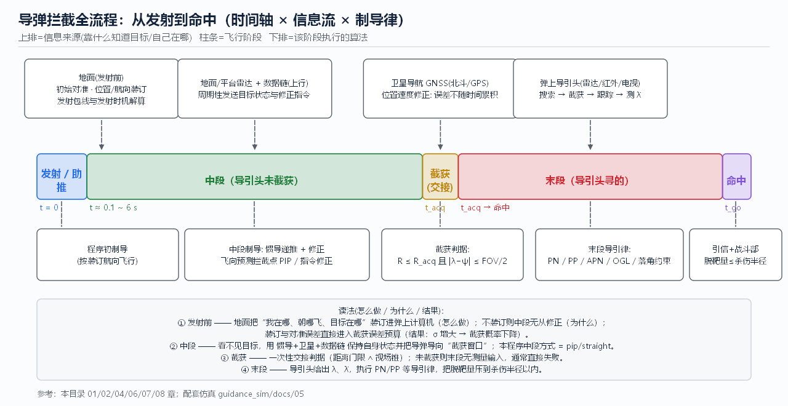

# 01 全流程总览：从发射到命中

> **本章回答**：一枚拦截导弹从地面点火到击中目标，中间到底分成几段？每段**靠什么信息**飞、**执行什么算法**、**失败长什么样**？
> 这是全书总纲，后续每一章都对应其中一段。



---

## 1. 阶段划分（一张表建立全局）

| 阶段 | 典型时长 | 导弹知道什么（信息来源） | 执行的算法 | 典型失效模式 | 对应章节 |
|------|---------|--------------------------|-----------|--------------|----------|
| ① 发射前准备 | 数秒~数分钟 | 地面雷达/情报给出的目标诸元；惯组通电自测 | 初始对准、参数装订、发射包线解算 | 对准误差大 → 后面一路带偏 | [02](02_发射前准备与地面引导.md) |
| ② 发射 / 助推段 | 0.1~2 s（固体发动机点火） | 程序装订的航向 + 惯组开始输出 | 程序转弯、推力矢量/燃气舵稳定 | 姿态发散、助推分离扰动 | [01](#3-逐段三问) |
| ③ 中段（导引头未开机/未截获） | 数秒~数十秒 | **自己的**：INS 递推 + GNSS + 数据链修正；**目标的**：地面雷达经数据链上报 | 飞向**预测拦截点**（或按装订直线飞）、指令修正 | 自身定位漂移 / 拦截点算错 → 目标进不了视场 | [04](04_位置修正_地面与卫星导航.md) · [05](05_组合导航与状态滤波.md) · **[06](06_中段制导与拦截点计算.md)** |
| ④ 截获（中→末交接） | 瞬间（判据持续满足即切换） | 导引头开机搜索：距离 + 视场角 | 判据 `R ≤ R_acq 且 |λ−ψ| ≤ FOV/2` | **未截获**：末段没有测量输入，几乎必失败 | **[06](06_中段制导与拦截点计算.md)** · [07](07_导引头与目标探测.md) |
| ⑤ 末段（导引头寻的） | 最后数秒 | 导引头连续测 `λ、λ̇`（部分还能测 R、Vc） | PN / PP / APN / OGL / 落角约束 | 过载饱和、目标剧烈机动、拖尾干扰 | **[08](08_末段导引策略_经典方法.md)** · [09](09_末段导引策略_现代与智能方法.md) |
| ⑥ 引信与战斗部 | 毫秒级 | 近炸引信（无线电/激光/红外）或触发 | 起爆控制、破片飞散方向 | 脱靶量 > 杀伤半径 → “打了但没毁” | [10](10_工程实践_场景指标与案例.md) |

**一句话串起来**：地面先把“我在哪、目标在哪、我要往哪飞”装进弹上计算机 → 中段靠**自己的惯导 + 卫星 + 数据链**闭着眼飞向拦截点 → 满足“距离∧视场”判据后导引头**睁眼** → 末段用 `λ̇` 实时修正 → 引信在最近点起爆。

---

## 2. 全流程数据流（ASCII 版，便于默记）

```
 发射前            中段                      末段                 命中
────────────────────────────────────────────────────────────────────────
 目标诸元 ─┐
 初始对准 ─┼→ 弹上状态 ─┬─ INS 递推 ──┐
 航向装订 ─┘   (x,v,ψ)  ├─ GNSS 修正 ─┼→ 组合状态 ─→ 拦截点 PIP/TOF ─┐
                        └─ 数据链修正 ─┘        ↑(地面雷达上报目标)   │
                                                │                    ▼
                        ┌─────────────── 目标估计(滤波) ──────────────┤
                        │                                             ▼
                        └────── 弹轴指向 PIP ────► 满足截获判据? ── 否→ 继续中段
                                                                    │是
                                                                    ▼
                              目标 λ,λ̇ ──► 导引律 PN/PP/OGL ──► a_cmd
                                                                    │
                                          过载限幅/舵机滞后 ◄───────┘
                                                                    ▼
                                          相对运动积分 ──► 脱靶量 d ≤ R_hit ?
                                                                    │
                                                        引信起爆 → 毁伤评估
```

**关键观察**：信息是**逐级换源**的——地面装订（一次性）→ 自主导航+外部修正（周期性）→ 导引头（末段连续）。
每换一次源，都要过一次“交接”（中→末交接就是截获判据）。

---

## 3. 逐段三问

### ① 发射前：地面准备

- **怎么做**：雷达/红外搜索跟踪系统测得目标航迹 → 火控解算给出射击诸元（目标当前状态、预测遭遇点、可用发射包线）；
  惯导系统完成初始对准（把真实重力/地球自转方向“教”给惯组）；把目标参数、航路点、引信与战斗部参数写入弹上计算机。
- **为什么**：中段导引的全部输入都是“相对量”，绝对基准只能在发射前建立。初始对准误差会以**同样的角度误差**
  一路传到截获时刻——视场是有限的，基准歪了就永远瞄不准。
- **结果怎么样**：初始对准误差与截获角误差近似 1:1 传递；如果总角误差预算接近 `FOV/2`，截获概率会**断崖式**下降。
  工程上把“对准误差 + 测量误差 + 装订误差 + 传播误差”做**平方和开方（RSS）**预算，要求 ≤ 可用视场的 1/2~1/3。[R09][R10]

### ② 发射/助推段

- **怎么做**：点火后按程序角转弯（或推力矢量控制），燃气舵/空气舵稳定姿态；助推器燃尽分离。
- **为什么**：中段制导假设“速度方向可以被过载指令持续改变”，前提是导弹已经获得足够速度且姿态可控；
  助推段必须先把速度和姿态建立起来，否则后面 `a = N·Vc·λ̇` 无从施加。
- **结果怎么样**：这一段通常**不开环修正目标**（目标信息还在地面），只保证“活着离架、姿态正常、速度达标”。

### ③ 中段：闭着眼飞向拦截点

- **怎么做**：用滤波后的自身状态 + 数据链给出的目标状态，解算**预测拦截点 PIP 与 TOF**（详见 [06](06_中段制导与拦截点计算.md)），
  生成中段指令把弹轴/速度方向转过去；同时用 GNSS、地面雷达指令持续修正自身位置误差。
- **为什么**：目标在 10 km 外时，导引头探测距离/视场都不够，导引头**没有可用测量**；
  没有测量就不闭环，但不闭环就会积累误差 → 所以中段的闭环对象是**“自己的位置 + 预测的拦截点”**，而不是“目标的视线”。
- **结果怎么样**：做得好 → 目标出现在视场中央、距离进入门限，截获水到渠成（本仿真 pip 中段 5.84 s 截获，见 [06](06_中段制导与拦截点计算.md)）；
  做得不好 → 三种典型失败：定位漂移（[04](04_位置修正_地面与卫星导航.md)）、拦截点算错（[06](06_中段制导与拦截点计算.md)）、弹轴没指向目标（截获判据角条件不满足）。

### ④ 截获：一次性的“睁眼”交接

- **怎么做**：开机搜索 → 满足 `R ≤ R_acq` **且** `|wrap(λ−ψ)| ≤ FOV/2` → 转入跟踪，切换末段导引律。
- **为什么**：两个条件缺一不可——距离不够是“看不见”，角差超视场是“看得见但没往那儿看”（本程序不建模万向架，视场随弹轴）。
- **结果怎么样**：截获是**概率事件**，工程上写成 `P_acq = P(R)·P(FOV)·P(SNR)·P(跟踪建立)`，
  任何一项接近 0 整体就接近 0。本仿真把判据做成了确定性开关（教学简化），详见 [07](07_导引头与目标探测.md)。

### ⑤ 末段：看见了就打

- **怎么做**：导引头输出 `λ、λ̇`（有的还给 R、Vc、Ṙ）→ 导引律算出过载指令 → 执行机构产生实际过载 → 改变速度方向。
- **为什么**：末段信息最全（直接测目标）、时间最短（秒级）、过载最贵（`a ∝ 1/t_go²`），
  所以导引律必须“用最小的过载把误差清零”——这就是 PN 及其变体成为主流的原因，详见 [08](08_末段导引策略_经典方法.md)。
- **结果怎么样**：脱靶量由**测量噪声、目标机动、执行机构滞后、过载饱和**四项共同决定；
  默认场景下本仿真 PN 脱靶 0.2 m，纯跟踪 PP 脱靶 67.8 m（详见 [08](08_末段导引策略_经典方法.md)、[10](10_工程实践_场景指标与案例.md)）。

### ⑥ 引信与战斗部

- **怎么做**：近炸引信测距（无线电/激光/光引信）在最接近点附近起爆，破片/射流按方向飞散。
- **为什么**：精确制导的目的不是“弹头撞目标”，而是**把脱靶量压进杀伤半径**；引信+战斗部的匹配决定了同样的脱靶量值多少杀伤概率。
- **结果怎么样**：`P_k ≈ 1 − exp(−R_hit²/(2σ²))`，σ 来自脱靶量散布，详见 [10](10_工程实践_场景指标与案例.md)。

---

## 4. 与本仿真程序的对应

`guidance_sim` 是**末段为主、中段可选**的 2D 教学仿真，与上表的对应关系：

| 阶段 | 仿真是否建模 | 在哪里 |
|------|-------------|--------|
| 发射前装订 | 简化为初始位置/速度/航向参数 | 参数面板「导弹/目标」 |
| 助推段 | 不建模（初始即匀速） | — |
| 中段 | **可选**：勾选「分段制导」→ `straight`（直飞）或 `pip`（飞向拦截点） | 参数面板「导引头 / 分段制导」 |
| 截获判据 | `R ≤ R_acq 且角差 ≤ FOV/2`，命中后一次性、保持 | 同上；画布上有 R_acq 圆与 FOV 扇形 |
| 末段 | PN / PP + 一阶舵机滞后 + 过载限幅 | `guidance.py` |
| 引信/战斗部 | 简化为 `R_hit` 判定（默认 25 m） | `simulation.py` |

**动手实验**（先跑一遍，建立手感）：

1. 不勾选「分段制导」→ 运行，记下 PN/PP 脱靶量（默认 0.2 m / 67.8 m）。
2. 勾选「分段制导」、中段方式=`pip` → 运行，观察画布上虚线（中段）与实线（末段）的分界点、截获 `×` 标记与时间。
3. 中段方式=`straight` + 把 FOV 改成 10° → 运行，应当看到“导引头未截获”的结果串（末段无测量输入 → 失控）。
4. 按 `S` 保存快照，对比三种配置的弹道形状差异。

---

## 5. 本章 FAQ

**Q1：为什么不能“一开始就朝目标飞”？**
朝目标**现在**的位置飞，必然落在目标身后——目标在你飞行期间又跑出一段距离。
正确做法是朝**相遇点**飞（前置量），这正是 [06](06_中段制导与拦截点计算.md) 要解决的问题。

**Q2：中段和末段的分界是谁定的？**
由**导引头能否提供有效测量**定的，不是由时间或距离人为划的。本仿真用 `R_acq ∧ FOV` 两个判据模拟这个客观条件。

**Q3：为什么不全程用数据链指令制导（不装导引头）？**
可以（近程防空确实有），但精度受地面雷达测角与链路延迟限制，越远越差、且地面站被牵制；
末段导引头把测量放到“离目标最近的平台”上，精度随距离**提高**。详见 [02](02_发射前准备与地面引导.md)。

**Q4：信息量是越到末段越多吗？**
是的：末段导引头直接测 `λ̇`，测量延迟最小、分辨率最高；中段的目标信息全部来自“间接链路”（雷达+数据链），
带延迟、带噪声。这也是为什么中段只负责“送进视场”，末段才负责“压脱靶量”。

**Q5：为什么先学总览？**
因为后面每一章都会出现“这个量属于哪一段、谁提供、误差谁负责”的问题，没有阶段框架很容易把
路径规划、拦截点、导引律三件事混为一谈（这是最常见的概念混淆，详见 [03](03_路径规划与航迹生成.md) 第 3 节）。

---

## 本章文献

- [R01] Zarchan 全书的“阶段划分与时间尺度”章节（7th ed., 卷1）
- [R03] Palumbo et al., *Basic Principles of Homing Guidance*, JHU APL Tech. Digest 2010 —— 制导回路与阶段思想的短文入门
- [R09] 雷虎民 等《导弹制导与控制原理》—— 中文教材中的总体阶段划分
- 下一章：[02 发射前准备与地面引导](02_发射前准备与地面引导.md) ｜ 返回 [总目录](README.md)
