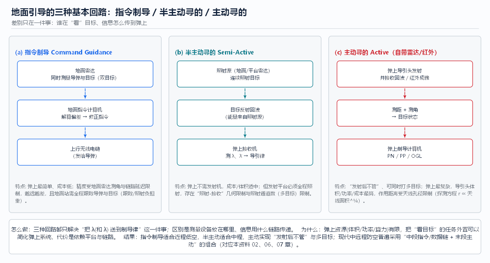

# 02 发射前准备与地面引导

> **本章回答**：导弹离架之前地面要准备什么？离架之后由地面“扶着飞”的那几段是怎么做的——
> **指令制导、驾束制导、照射制导**三种回路分别怎么做、为什么、效果如何？

---

## 1. 发射前准备：对准 + 装订 + 解算

### 1.1 初始对准（怎么做）

**问题**：惯导系统（INS）积分需要初值——位置、速度、**姿态**。位置/速度可由外部输入，姿态必须“测出来”。

- **粗对准（数秒级）**：静基座下，用加速度计感测重力方向确定**水平基准**（俯仰/滚转）；
  用陀螺感测地球自转分量确定**方位基准**（北向）。重力方向好找，地球自转角速度极小（≈15°/h），所以方位对准最慢、最难。
- **精对准（数十秒~分钟级）**：在粗对准基础上用滤波估计陀螺零偏、安装误差，把水平/方位误差压到角分级。
- **动基座/传递对准**：发射平台（车/舰/机）在运动中，无法静基座对准 → 用**参考系统**（平台惯导或高精度 GNSS/INS）
  的姿态通过“杆臂与挠曲补偿”传递给弹上惯导，几分钟内完成。[R07]

**为什么**：姿态误差直接污染所有后续测量——弹体坐标系歪 α 角，所有加速度投影都带 α 的系统偏差，
积分后位置误差随时间放大；到截获时刻它就是**视场角误差**的一部分。

**结果怎么样**：对准误差是不可修的“先天量”，工程上按 RSS（平方和开方）并入截获角误差预算；
经验设计目标是让**总角误差 ≤ FOV/4~FOV/6**，给目标机动与滤波噪声留余量。[R07][R09]

### 1.2 参数装订（怎么做）

火控计算机写入弹上计算机的典型内容：

| 类别 | 内容 | 用途 |
|------|------|------|
| 目标诸元 | 目标位置/速度/航向（及协方差） | 中段拦截点解算的输入（[06](06_中段制导与拦截点计算.md)） |
| 自身基准 | 发射点坐标、初始航向、高度表/气压基准 | INS 积分初值 |
| 航路/约束 | 航路点、禁射区、走廊、转弯方向 | 中段弹道形状（[03](03_路径规划与航迹生成.md)） |
| 制导参数 | 导航比 N、过载限幅 Gmax、舵机时间常数 τ | 末段导引律（[08](08_末段导引策略_经典方法.md)） |
| 引战参数 | 引信模式、杀伤半径、起爆延时 | 命中判定（[10](10_工程实践_场景指标与案例.md)） |
| 交接参数 | `R_acq`、`FOV`、导引头开机时机 | 截获判据（[06](06_中段制导与拦截点计算.md)） |

**为什么**：中段不可能“边飞边问地面全部参数”——链路带宽与延迟都有限，能在发射前一次写完的绝不占用飞行中的链路。

### 1.3 发射条件与发射包线解算（怎么做 / 为什么）

火控要回答“**现在能不能打、朝哪儿打**”：

1. 解算**发射包线**：给定目标当前状态，反推可用的发射距离/高度/方位范围（受导弹速度、过载、燃料、导引头作用距离约束）；
2. 解算**射击诸元**：给出瞄准点与发射时机，使目标**落入中段末的截获窗口**（而不是“现在指向目标”）；
3. 处理**禁射条件**：己方/友邻方向、超掩护界、最低射界等。

**结果怎么样**：发射包线的边界本质上由三件事共同决定——导弹能量（速度/过载余量）、
导引头截获条件（距离与视场）、末段可用过载。任一条件不满足，包线就收缩；
这解释了为什么“尾追难打、迎头好打”（迎头相对接近快、要求的前置角与过载分布更有利，详见 [10](10_工程实践_场景指标与案例.md)）。

---

## 2. 地面引导：三种基本回路

地面引导的共同任务只有一个：**在导引头截获之前（以及不装导引头的全程），把“目标在哪、我该往哪修正”送进弹上制导律**。
差别只在“谁在看目标、信息怎么传”。

### 2.1 指令制导 Command Guidance

- **怎么做**（见图上排 a）：
  1. 地面雷达**同时**跟踪导弹与目标（导弹装应答机/信标，便于精确测导弹位置）；
  2. 指令计算机算出**偏差**（如“导弹在目标线上方 x 米”或相对前置点的偏差）；
  3. 编码后经**上行无线电链**发给导弹，弹上解码 → 变成舵指令。
- **为什么**：把最贵的测量设备（大孔径雷达、大算力计算机）留在地面，弹上只需接收机+解码+舵机，
  成本低、体积小，适合近程大批量。
- **结果怎么样**：
  - 精度随距离与视线角速度增大而变差（测角误差 × 距离 = 横向误差）；
  - 链路延迟（数十毫秒级）在高速交会时等效为**滞后相位**，会消耗稳定裕度；[R04]
  - 地面站被“绑定”：必须全程跟踪，反雷达火力下站毁即失控。

### 2.2 驾束（波束）制导 Beam Riding

- **怎么做**：地面雷达/激光形成一个编码波束（方位、俯仰分别用不同编码调制），导弹在波束内飞行；
  弹上只测“我偏离波束中心多少”，把自己拉回中心 → 天然地跟着波束指向的目标走。
- **为什么**：比指令制导更简单——不需要地面测导弹、不需要算偏差，弹上也无须知道目标在哪；
- **结果怎么样**：越靠近发射端波束越窄、精度越好；远端波束展宽+抖动，精度下降；
  同样被链路/站牵制，且多目标能力差（一个波束一个目标）。[R04][R09]

### 2.3 照射制导（半主动寻的） Semi-Active Homing

- **怎么做**：照射源（地面/平台雷达，或激光照射器）连续照射目标，弹上接收机收**目标反射回波**，
  测 `λ、λ̇`，末段完全按寻的律飞行（见图 b）。
- **为什么**：测量发生在弹上（离目标越来越近），精度随距离**改善**——这是它比指令制导强的根本原因；
  而发射机留在平台，弹上只装接收机，比主动导引头便宜轻便。
- **结果怎么样**：中程防空的经典方案；限制是平台必须**全程照射**（照射通道数 = 同时交战数），
  且存在“照射源-目标-导弹”的几何约束（导弹不能跑到波束外）。[R02][R03]

### 2.4 主动寻的 Active（对照）

弹上自带发射机与接收机 → **发射后不管**、多目标；代价是导引头体积/功率/成本最高、作用距离受孔径限制。
现代中远程弹药普遍是“**中段指令/数据链 + 末段主动**”的组合（正是图 1 的全流程结构）。

---

## 3. 数据链：地面/卫星修正的物理通道

数据链是 01 章里“中段信息来源”的载体，值得单独说清：

| 方向 | 传输内容 | 频率量级 | 关键约束 |
|------|---------|---------|---------|
| 上行（地面→弹） | 目标状态更新、拦截点修正、导引头开机/交接指令、航路改点 | Hz 级（飞行中周期性发送） | 带宽小、有延迟、需编码加密、易被干扰 |
| 下行（弹→地面） | 导弹自身状态、导引头截获状态、燃料/健康 | Hz 级 | 暴露自身（辐射源），需要时要静默 |

**为什么修正必须周期性**：INS 误差随时间增长（详见 [04](04_位置修正_地面与卫星导航.md)），
一次修正只能把误差“清零一次”，之后继续发散 → 修正节奏必须与发散速度匹配。

**结果怎么样 / 常见坑**：
- **延迟**：数据链延迟 + 雷达处理延迟会让目标状态是“过去的”→ 拦截点要按延迟外推补偿；
- **丢包**：丢一次不影响（下次补上），但连续丢包期间误差累积；
- **干扰/欺骗**：上行被压制 = 中段失去目标信息（表现就是截获不了）；
- **静默需求**：辐射会暴露位置，战术上常在末段关闭数据链改用导引头。

---

## 4. 三问小结（本章横向对比）

| 维度 | 指令制导 | 驾束制导 | 半主动照射 | 主动寻的 |
|------|---------|---------|-----------|---------|
| 谁在看目标 | 地面雷达 | 波束指向（目标须在波束内） | 平台照射 + 弹上接收 | 弹上导引头 |
| 弹上复杂度 | 低 | 最低 | 中 | 高 |
| 精度随距离 | 变差 | 变差 | **变好** | **变好** |
| 平台牵制 | 全程跟踪 | 全程照射 | 全程照射 | 无（发射后不管） |
| 多目标能力 | 差 | 差 | 受照射通道限制 | 强 |
| 典型定位 | 近程低空 | 近程简易 | 中程 | 中远程末段 |

**一句话**：把“看目标”放在哪，决定了精度趋势、平台牵制与多目标能力——这是选择制导体制时的第一性问题。

---

## 5. 动手实验（本仿真）

仿真里没有地面雷达实体，但可以**等价模拟**“有/无地面修正”的差别：

1. **有修正（类比数据链更新拦截点）**：勾选「分段制导」，中段方式=`pip` → 每步重算拦截点并转向它；
   观察截获时刻、截获距离（默认 5.84 s / 3.99 km）。
2. **无修正（类比链路中断/地面站失效）**：中段方式=`straight` → 导弹按发射航向直飞；
   再把 FOV 调到 10°，结果串会出现“导引头未截获”，脱靶约 597 m。
3. **思考题**：把目标速度从 250 m/s 提到 400 m/s 再跑 `straight`，脱靶会变大还是变小？为什么？
   （提示：目标跑得越快，"直飞"与"拦截点"的偏差越大，见 [06](06_中段制导与拦截点计算.md)。）

---

## 本章文献

- [R02] Siouris, *Missile Guidance and Control Systems*, 2004 —— 三种遥控制导回路与导引头体制的系统描述
- [R04] Garnell & East, *Guided Weapon Control Systems*, 2nd ed., 1980 —— 指令/驾束/照射回路与稳定性分析经典
- [R07] Titterton & Weston, *Strapdown Inertial Navigation Technology*, 2nd ed. —— 初始对准（含传递对准）
- [R09] 雷虎民 等《导弹制导与控制原理》—— 中文教材对发射前准备与遥控制导的表述
- 上一章：[01 全流程总览](01_全流程总览_从发射到命中.md) ｜ 下一章：[03 路径规划与航迹生成](03_路径规划与航迹生成.md) ｜ [总目录](README.md)
