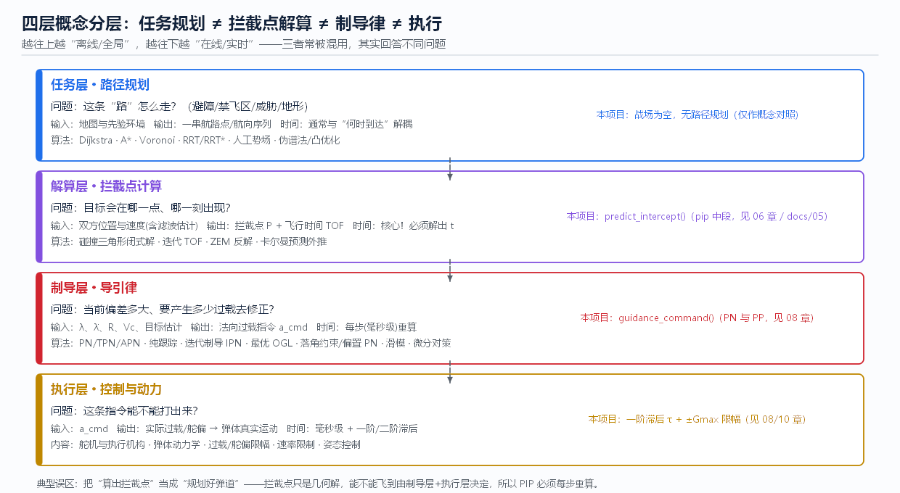

# 03 路径规划与航迹生成

> **本章回答**：路径规划到底在解什么问题？它和“计算拦截点”“导引律修正”**差在哪**？
> 常见算法（Dijkstra/A*/RRT/人工势场/最优控制/凸优化）分别怎么做、为什么、效果如何？

**先记住这张四层图**（图 fig07）：任务层（路径规划）→ 解算层（拦截点）→ 制导层（导引律）→ 执行层。
四层回答四个不同问题，混用就会出现“明明算出了拦截点，弹道却飞不进去”的困惑。

---

## 1. 四层的本质区别（本章核心）

| 维度 | 路径规划（任务层） | 拦截点解算（解算层） | 导引律（制导层） |
|------|-------------------|---------------------|------------------|
| 回答什么问题 | 这条**路**怎么走（避障/禁飞/地形） | 目标会在**哪一点、哪一刻**出现 | 当前偏差要产生**多少过载** |
| 输入 | 地图、威胁、禁飞区、航路点 | 双方位置速度（含估计与协方差） | `λ、λ̇、R、Vc`、目标机动估计 |
| 输出 | 一串航路点 / 航向序列 | 拦截点 P + 飞行时间 TOF | 法向过载指令 `a_cmd` |
| 是否含**目标运动模型** | 通常不含（或把目标当障碍） | **必须含**（否则没有“相遇”可言） | 含（目标机动项） |
| 时间尺度 | 分钟~小时；与“何时到达”弱耦合 | 每次要解一次 `t`，飞行中周期性重算 | **每步**（毫秒~几十毫秒）重算 |
| 典型性质 | 全局/离线、组合优化 | 闭式解或迭代（数值解 `t`） | 闭环反馈（在线） |

**一句话**：路径规划求“**路线**”，拦截点求“**时空交会点**”，导引律求“**此刻的修正量**”。
拦截点不是路径规划——它只解一个方程；但中段为了飞进截获窗口，会把“指向拦截点”当作用航向，
于是看起来像是“规划了一条线”（其实那条线每步都在重算，见 [06](06_中段制导与拦截点计算.md)）。

---

## 2. 路径规划算法：怎么做 / 为什么 / 结果

### 2.1 图搜索：Dijkstra 与 A*

- **怎么做**：把空间离散成图（网格/航路点/可视图），Dijkstra 从起点**均匀外扩**求最小代价；
  A\* 引入启发项 `f = g + h`（`h` 常取欧氏距离或对角距离），向目标方向**有偏外扩**。
- **为什么**：只要代价非负且 `h` 不高估（admissible），A\* 找到的就是**最优解**——这是它比 Dijkstra 快且同样最优的原因。
- **结果怎么样**：最优性保证 ✓；代价是**内存与展开节点数随维度爆炸**（3D 空间+时间就很难受），
  且网格分辨率决定解的质量。工程上常把它们用于**离线航路规划**，在线段改用其他方法。[R18][R19]

### 2.2 采样法：RRT / RRT\*

- **怎么做**：从起点与（伪）随机点反复“生长”小段路径，用最近邻连接；RRT\* 在生长后做**重连（rewire）** 逼近最优。
- **为什么**：高维空间里网格法的节点数是指数的，采样法以概率完备换取**近似最优 + 高维可行**。
- **结果怎么样**：速度快、能处理复杂几何约束；但解**有随机性**（每次不同）、路径**锯齿状**，
  需要后处理（平滑/最小曲率）才能变成可飞的弹道。[R20]

### 2.3 人工势场（APF）

- **怎么做**：目标产生引力、障碍产生斥力，合力方向作为运动方向，梯度下降式逼近目标。
- **为什么**：实现极简、天然**在线**，适合实时局部避障。
- **结果怎么样**：快、直观；两大经典缺陷——① **局部极小**（在引力斥力平衡点卡住），
  ② 目标附近震荡。改进：虚拟目标、调和势场、与全局规划器级联。[R21]

### 2.4 Voronoi 图 / 可视图（威胁规避）

- **怎么做**：把威胁源看作点，Voronoi 边界 = 到最近威胁等距的轨迹 → 沿边界飞 = 最大化与各威胁的距离。
- **为什么**：把“处处保持距离”的连续优化变成**离散图搜索**，可直接喂给 A\*。
- **结果怎么样**：对防空火力威胁的启发式很有效，但通常**离目标越近代价越高**，需与末段弹道衔接。

### 2.5 最优控制 / 伪谱法（轨迹生成）

- **怎么做**：把轨迹写成参数（配点/伪谱多项式），把动力学、禁飞区、落角、过载、终端约束全部写成约束，
  直接求解带约束非线性规划（NLP）或凸化后的凸问题。[R22][R23]
- **为什么**：能**同时**处理“多约束 + 能量最优/时间最优 + 终端状态要求”——这是图搜索/采样做不到的（它们只优化路径长度类指标）。
- **结果怎么样**：能得到可飞、满足全部硬约束的最优轨迹；代价是**求解耗时与收敛性**依赖初值，
  工程上常用“凸化 + 内点法”把求解时间压到毫秒~百毫秒级，用于在线重规划。

### 2.6 走廊 + 凸优化（工程常见折中）

把自由空间切成**凸通道（椭球/多面体走廊）**，每段内求最优轨迹，段间用一致性约束拼接：
把 NP-hard 的全局避障问题变成**一串凸子问题**——确定性、可实时、可保证收敛，是当前在线轨迹规划的主流工程套路（近似做法见各无人机/导弹轨迹规划文献，🔍 建议检索最新综述）。

---

## 3. 导弹特有的多约束（比“机器人避障”多出来的题）

| 约束 | 含义 | 影响哪一层 |
|------|------|-----------|
| 过载/曲率上限 | 弹体能打出的 `a_max` 决定最小转弯半径 | 制导层+执行层 |
| 落角/攻顶角 | 破甲/侵彻需要特定着角 | 解算层+制导层（[09](09_末段导引策略_现代与智能方法.md)） |
| 能量/速度管理 | 高度换速度、末端必须留足可用过载 | 任务层+制导层 |
| 时间窗/协同 | 多弹同时到达（salvo） | 解算层+制导层（[09](09_末段导引策略_现代与智能方法.md)） |
| 截获窗口 | 中段终点必须落在 `R_acq ∧ FOV` 内 | **解算层**（[06](06_中段制导与拦截点计算.md)） |
| 地形遮蔽/禁射 | 避免撞地、避免越界 | 任务层 |

**关键点**：这些约束里只有“地形/禁飞”属于纯路径规划，其余都直接进拦截点与导引律。
这正是四层要分开管理的原因。

---

## 4. 三问小结

- **怎么做**：先在任务层给出**满足几何/威胁约束的走廊与航路** → 解算层在走廊内解**时空交会点** →
  制导层用过载把状态**实时拉回**期望轨迹 → 执行层把指令变成真实运动（有滞后与限幅）。
- **为什么**：各层的输入性质不同（地图是先验的、目标状态是估计的、视线测量是实时的），
  混在一层里做会导致：在线算不动（全局搜索）、或离线规划的路到现场不可飞（没有动力学/过载约束）。
- **结果怎么样**：分层的典型收益是——规划层可以“慢而优”，制导层“快而稳”，解算层“准而可重算”；
  失败模式也分层可观测：路是通的但没到时间（时间窗失败）、到了但过载不够（执行层失败）、
  算得出点却截获不了（截获窗口失败）。

---

## 5. 动手实验

`guidance_sim` 的战场是**空的**（无地图、无障碍），因此**不包含路径规划**——这本身就是一个教学点：

1. 跑默认场景，观察弹道是“被视线牵引出来的”，不是先有路径再飞：这就是制导层的特征。
2. 勾选「分段制导」+ `pip`，画布上中段虚线几乎是**直指拦截点**的线段——它是**每步重算**的期望方向，
   不是预先规划的路径（把目标速度改一改，重跑看这条“线”怎么变）。
3. 思考：如果给它加一个禁飞圆（障碍），`predict_intercept()` 的直飞指令会穿过去吗？
   会——因为解算层根本不知道障碍存在。要解决它必须**在任务层先给出绕飞航路**，再让中段沿航路导引。
   这就是“路径规划 ≠ 拦截点解算”的可执行证明。

---

## 本章文献

- [R18] Dijkstra 1959 ｜ [R19] Hart et al. 1968（A\*）｜ [R20] LaValle 1998（RRT）
- [R21] Khatib 1986（人工势场）｜ [R22] Betts, *Practical Methods for Optimal Control…*, 2nd ed., 2010（伪谱/配点）
- [R23] Bryson & Ho, *Applied Optimal Control*（最优控制方法论）
- 🔍 导弹在线轨迹规划（凸优化/走廊法）建议以近三年 AIAA JGCD、IEEE TAES 的综述为入口自行检索
- 上一章：[02 发射前准备与地面引导](02_发射前准备与地面引导.md) ｜ 下一章：[04 位置修正：地面与卫星导航](04_位置修正_地面与卫星导航.md) ｜ [总目录](README.md)
