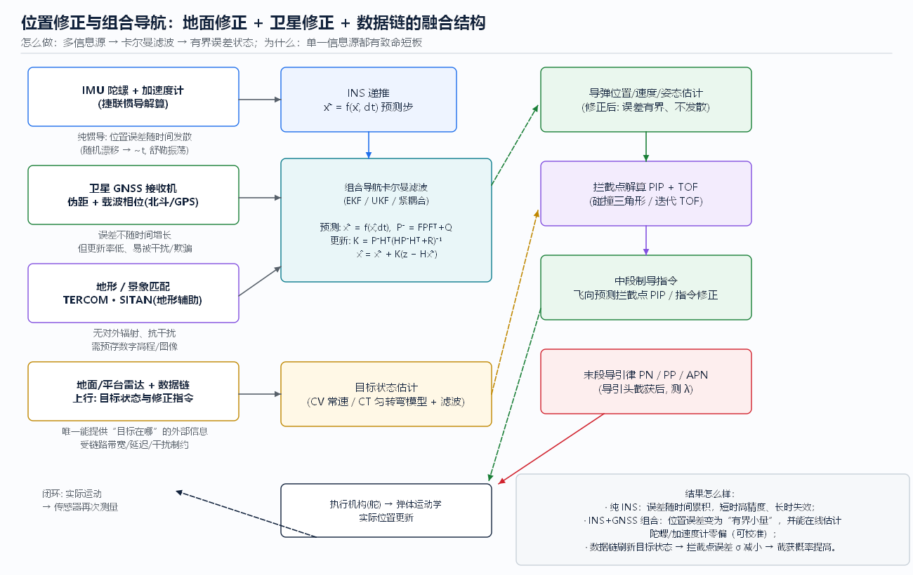

# 04 位置修正：地面与卫星导航

> **本章回答**：导弹怎么知道自己在哪、误差从哪来？
> **地面修正**（雷达/无线电导引/数据链）与**卫星修正**（GNSS）分别怎么做、为什么需要、结果差多少？



---

## 1. 为什么必须修正：惯导的“先天病”

### 1.1 INS 怎么工作（怎么做）

捷联惯导把陀螺与加速度计**直接固连**在弹上：

1. 陀螺输出角速率 → 姿态更新（方向余弦阵/四元数）；
2. 加速度计输出**比力** → 姿态阵投影到导航系 → 减去重力 → 得地理加速度；
3. 两次积分得速度与位置。

### 1.2 误差从哪来（为什么）

| 误差源 | 性质 | 后果（量级直觉） |
|--------|------|------------------|
| 陀螺零偏/随机游走 | 缓慢漂移 | 姿态角误差 → 重力泄漏进水平加速度 → 位置误差**随时间二次方增长** |
| 加速度计零偏 | 常值+慢变 | 直接进积分：速度一阶、位置二阶增长 |
| 初始对准误差 | 常值角误差 | 恒定的重力泄漏 → 位置误差随时间**二次方**增长（最隐蔽、最难查）[R07] |
| 标度因数/安装误差 | 与机动相关 | 机动越多错越多 |
| 地球模型/科氏项近似 | 系统性 | 短程可忽略，远程需补偿 |

**定性结论（为什么必须外部修正）**：纯 INS 是**自主、无延迟、难干扰**的，但误差**无界增长**；
它的误差曲线像“越走越歪的开环积分器”。战术时间尺度（数十秒~分钟）内，中高精度惯导还能撑，
但要把截获角误差压进视场预算，通常仍需周期性“清零/校准”——这就引出地面修正与卫星修正。[R07]

> 工程直觉（数量级，供估算用，具体数值取决于惯导等级）：按“每小时多少海里”的漂移率指标换算到**几十秒**战术窗口，
> 位置误差通常在米~百米量级；再乘上“角度误差影响拦截点”的几何放大，就足以吃掉大部分截获角预算。
> 因此中段**必须**有修正源（这也是仿真里 `pip` 需要目标+自身状态都可靠的原因）。

---

## 2. 地面修正：雷达与数据链

### 2.1 怎么做

- **地面/平台雷达跟踪**：雷达同时测目标与导弹（导弹带应答机），得到两者的距离、方位、仰角；
- **数据链上行**：把目标状态（位置/速度/协方差）与对导弹的修正量（位置校正、拦截点更新、指令）周期性发给导弹；
- **弹上融合**：用收到的量测做滤波校正（详见 [05](05_组合导航与状态滤波.md)），把 INS 误差“拉回来”。

### 2.2 为什么

- 目标状态**只有地面/平台能看到**（中段导引头未开机）——数据链是目标信息的**唯一通道**；
- 导弹位置修正可以用链路下的雷达测量完成，**不依赖卫星**（抗卫星干扰）；
- 缺点同样明确：链路延迟、带宽有限、易被干扰/压制，且地面站是高价值目标（见 [02](02_发射前准备与地面引导.md)）。

### 2.3 结果怎么样

- 修正后位置误差由“发散”变为**有界波动**（每次修正清零一次，随后重新发散）——误差曲线呈锯齿状；
- 拦截点误差 σ 与**目标状态 σ、自身状态 σ、链路延迟**按 RSS 合成，直接进入截获角预算（[06](06_中段制导与拦截点计算.md)）；
- 丢包/中断期间误差重新发散 → **修正节奏**（Hz）要匹配发散率。

---

## 3. 卫星修正：GNSS（GPS/北斗等）

### 3.1 怎么做（原理）

接收机收 4 颗以上卫星信号，解 **伪距（码相位）+ 载波相位** → 最小二乘/卡尔曼解出位置速度与钟差：

```
伪距 ρ_i = |r_接收机 − r_卫星i| + c·(δt_接收机 − δt_卫星) + 电离层 + 对流层 + 多径 + 噪声
```

- **单点定位**：米级~十米级（受星历、电离层、多径影响）；
- **差分/载波相位**：厘米~分米级（飞行时间短、动态高时通常只用伪距/多普勒）；
- **更新率**：通常 1~100 Hz 量级，动态载体需要高更新率与合适的载噪比。[R08][R16]

### 3.2 为什么

- 误差**不随时间增长**（这是与 INS 的本质互补）：INS 短期平滑、长期漂移；GNSS 长期有界、短期有噪声/延迟。
- 二者组合后：位置误差变成**有界小量**，并且滤波器能**在线估计惯组零偏**（把“病根”一起治了）。[R08]

### 3.3 结果怎么样 / 为什么还要地面修正

| 对比项 | 地面雷达+数据链 | GNSS |
|--------|----------------|------|
| 误差随时间 | 修正间隔内重新发散 | 有界、不发散 |
| 对平台依赖 | 重（地面站/照射） | 无（接收即可） |
| 延迟 | 链路延迟（毫秒~百毫秒级） | 接收机解算延迟（毫秒级） |
| 抗干扰 | 依赖链路保密与站生存 | **弱信号 → 易被压制/欺骗**（GNSS 是“被动接收”的双刃剑） |
| 是否提供目标状态 | **提供（目标信息！）** | 只提供自己位置，**不知道目标在哪** |

**关键结论**：GNSS 修“**我在哪**”，数据链给“**目标在哪**”——两者不能互相替代。
这就是图 fig04 里四个信息源各司其职、必须融合的根本原因。

---

## 4. 地形/景象匹配（第三种修正）

- **做法**：TERCOM（地形高度剖面匹配）用气压/惯导高度与数字高程剖面做相关；SITAN（景象/地图匹配）
  把实测地形特征与预存数字地图/图像做匹配，得到位置修正量。
- **为什么**：**不辐射、难干扰、不依赖卫星**——在 GNSS 被压制的对抗环境里是重要备份。
- **结果怎么样**：只在“有地形特征且飞行高度合适”时可用（海面、平原无效），且**需要预存高精度基准图**；
  匹配成功给出绝对位置修正，失败则回退 INS+其它源。[R07][R09]

---

## 5. 融合结构（对照图 fig04）

```
IMU ──► INS 递推 ──────────────┐(预测)
GNSS ──► 伪距/多普勒 量测 ──────┼──► 组合卡尔曼滤波 ──► 有界误差的状态估计
地形匹配/雷达/数据链 量测 ──────┘        │
目标状态(数据链) ──► 目标状态估计 ────────┼──► 拦截点 PIP + TOF ──► 中段制导指令
                                         └──► 末段导引律(截获后)
```

三个要点：
1. **预测**永远来自 INS（高频、平滑），**修正**来自各种外部量测（低频、有噪声/延迟）；
2. **目标状态估计**与**自身状态估计**是两个并列的滤波器（不同状态向量、不同量测源）；
3. 任何一路失效都只降级、不致命——这就是**多源冗余**的意义（GNSS 被干扰 → 还有雷达链路；链路断 → 还有 INS+GNSS）。

---

## 6. 三问小结

- **怎么做**：INS 高频递推 + 外部量测周期性校正 + 卡尔曼滤波把两者按噪声统计最优地融合（[05](05_组合导航与状态滤波.md)）。
- **为什么**：单一信息源都有致命短板（INS 发散 / GNSS 被干扰且不提供目标 / 雷达链路被牵制且有延迟）；
  融合后误差**有界**且能估计传感器零偏，拦截点与截获窗口才站得住。
- **结果怎么样**：修正后的状态误差是“锯齿状有界”而非“开环发散”；
  截获概率与角误差预算直接相关（[06](06_中段制导与拦截点计算.md)），数据链中断 → 拦截点 σ 增大 → 截获概率下降。

---

## 7. 动手实验

仿真本身把导航环节**理想化**（位置精确已知），可做两个“反事实”实验理解其重要性：

1. **关闭一切修正**：勾选「分段制导」+ `straight`（相当于“只有装订航向、无任何更新”），
   结果：截获失败、脱靶 ~597 m —— 对应“地面/卫星修正全失效”的后果。
2. **只算不修（错误的修正）**：把中段方式设为 `pip` 但把**目标速度**输入设错（如目标实际转弯而按直线外推），
   观察截获距离/截获角差变差——对应“目标状态估计误差”的影响。
3. 延伸思考：若给 `predict_intercept()` 的输入加上高斯噪声再迭代，脱靶量会如何变化？
   （这正是 [05](05_组合导航与状态滤波.md) 里 Q/R 调参要权衡的东西。）

---

## 本章文献

- [R07] Titterton & Weston, *Strapdown Inertial Navigation Technology*, 2nd ed. —— 惯导误差模型、对准、地形辅助
- [R08] Grewal/Weill/Andrews, *GPS, Inertial Navigation, and Integration*, 2nd ed. —— GNSS/INS 组合与误差互补
- [R16] Kaplan & Hegarty, *Understanding GPS/GNSS*, 3rd ed. —— 伪距原理与干扰脆弱性
- [R15] Bar-Shalom et al. —— 多源量测融合与跟踪滤波
- [R09] 雷虎民 等《导弹制导与控制原理》—— 惯导/卫星/复合制导中文章节
- 上一章：[03 路径规划与航迹生成](03_路径规划与航迹生成.md) ｜ 下一章：[05 组合导航与状态滤波](05_组合导航与状态滤波.md) ｜ [总目录](README.md)
