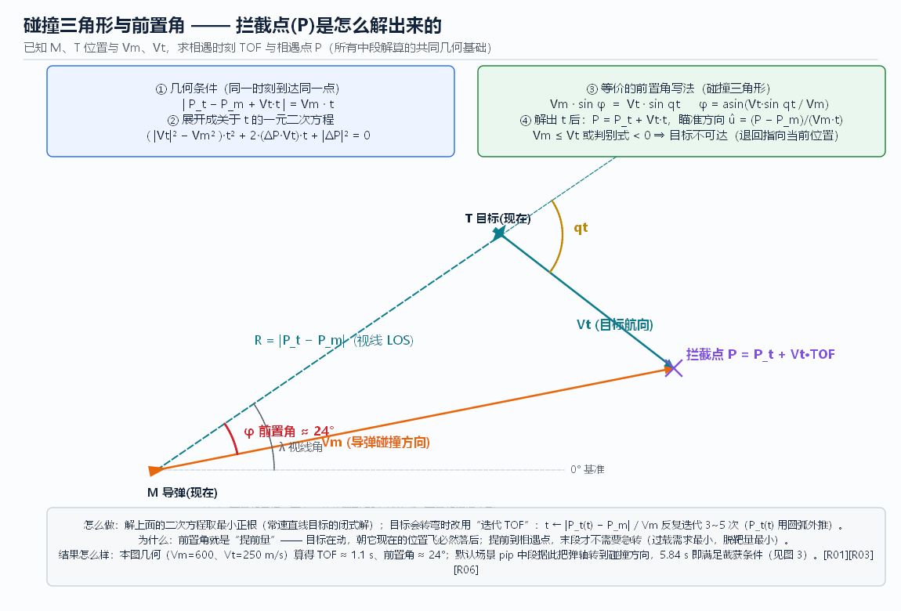
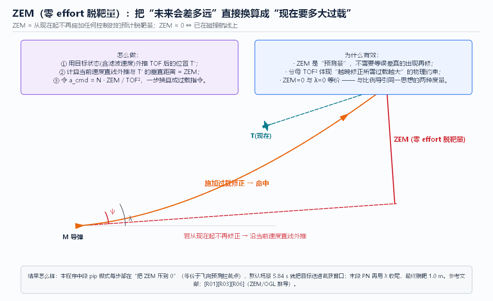

# 06 中段制导与拦截点计算（核心章）

> **本章回答**：导引头还没截获目标的这段（中段），导弹**凭什么**飞？
> 拦截点到底怎么算（碰撞三角形 / 迭代 TOF / ZEM）、算错了会怎样、怎么保证末段能“睁眼看见”？

 　


---

## 1. 问题的本质

末段导引律的输入是 `λ、λ̇`——**必须有导引头**。中段导引头没开机/没截获 → 没有 `λ` → 无法闭环。
那中段闭环什么？答案：**“把自身状态导引到能截获目标的状态”**，即

```
中段的期望终端状态：  R ≤ R_acq   且   |λ − ψ| ≤ FOV/2   且   剩余时间/能量满足末段需求
```

要做到这一点需要三件事：① 知道**自己**在哪（[04](04_位置修正_地面与卫星导航.md)/[05](05_组合导航与状态滤波.md)）；
② 知道**目标**在哪并预测它去哪（本章）；③ 把弹轴/速度方向指过去（中段导引律，本章 §4）。

---

## 2. 拦截点计算（怎么做）

### 2.1 碰撞三角形：常速目标的闭式解

设当前导弹位置 `P_m`、速度 `V_m`（大小 `Vm`），目标位置 `P_t`、速度 `V_t`（大小 `Vt`），设相遇时间为 `t`：

```
导弹飞到相遇点的距离  =  目标相遇点与导弹的距离
| P_t + V_t·t − P_m |  =  V_m · t
```

令 `ΔP = P_t − P_m`，两边平方展开：

```
( |V_t|² − V_m² )·t²  +  2·(ΔP·V_t)·t  +  |ΔP|²  =  0     ← 一元二次方程，只解 t
```

- `a = |V_t|² − V_m² < 0`（弹比目标快）且判别式 ≥ 0 → 有两个实根，**取最小正根**；
- 判别式 < 0 或无正根 → **目标不可达**（追不上/几何不相交）→ 退化策略：指向目标当前位置，并报告“不可达”；
- 解出 `t* = TOF` 后：**拦截点 `P = P_t + V_t·t*`**，瞄准方向 `û = (P − P_m) / (V_m·t*)`。

**等价的前置角写法**（图 fig02）：碰撞三角形中

```
V_m · sin φ  =  V_t · sin qt        φ = asin( V_t·sin qt / V_m )
```

`φ` 就是**提前量**——这解释了为什么不能“朝目标现在的位置飞”（那样必然落在它身后）。[R01][R03][R06]

### 2.2 目标会转弯：迭代 TOF

真实目标会机动，`P_t(t)` 不再是直线外推。做法（本仿真采用）：

```
t ← |ΔP| / Vm                       （初值）
循环 3~5 次:
    P_t ← Target.position_at(t)     （按当前转弯率做圆弧外推）
    t   ← |P_t − P_m| / Vm
输出: t, P = P_t(t), û
```

**为什么迭代就够**：单步时间尺度内目标机动率有限，3~5 次迭代已收敛（残差 < 1 m 量级）；
如果目标剧烈机动，交由**目标状态滤波 + 每步重算**来兜底（中段每步都重算 PIP，见 §4）。
**结果**：闭式解（直目标）+ 迭代（机动目标）覆盖绝大多数中段解算需求；
工程上还有用**扩展卡尔曼预测**代替几何迭代的做法（[R15]）。

### 2.3 ZEM：把几何问题换成控制问题

**ZEM（zero-effort miss，零 effort 脱靶量）**：从当前时刻起**不再施加任何控制**，最终会错过的距离。



- **怎么做**：按当前相对运动状态外推至 `t_go`，求预测脱靶距离 = ZEM；
- **为什么有用**：它把“未来会错多远”**一步换算成“现在要多大过载”**：
  `a_cmd ≈ N · ZEM / t_go²`——分母 `t_go²` 精确刻画了“越晚修正所需过载越贵”的物理约束；
- **与 λ̇ 的关系**：`ZEM = 0 ⇔ λ̇ = 0`（已在碰撞航线上）——ZEM 度量与比例导引是同一思想的两种写法；
- **结果**：中段“飞向 PIP”本质上就是“每步把 ZEM 压到 0”；末段 PN 是“用 λ̇ 压 ZEM”。
  ZEM 表达式是**最优制导律（OGL）** 与许多工程制导律的出发点（[R01][R03][R23]）。

### 2.4 误差从哪来（结果怎么样，前半）

拦截点误差 σ 由输入误差合成（RSS）：

```
σ_PIP² ≈ σ_自身位置² + (t·σ_自身速度)² + σ_目标位置² + (t·σ_目标速度)² + (V_t·σ_链路延迟)²
```

**关键洞察**：
1. **速度误差乘以 TOF** 才是大头（外推放大）——这就是为什么目标状态必须滤波（[05](05_组合导航与状态滤波.md)）；
2. **链路延迟**等价于目标多跑一段 `V_t·Δt`——延迟必须补偿外推；
3. TOF 越长误差越大 → **“能早打就别晚打”**（中段尽早收敛比末段硬拼更省过载）。

---

## 3. 截获窗口：怎么算出“能看见”的条件

截获判据（图 fig03，本仿真采用）：

```
截获 ⇔  R ≤ R_acq   且   | wrap(λ − ψ) | ≤ FOV/2
```

- **R 条件**：距离门限——超过导引头作用距离，开机也测不到目标（能量/灵敏度门限）；
- **FOV 条件**：视场是**随弹轴的圆锥**（本仿真不建模万向架，属教学简化；实际导引头可用万向架+搜索扫掠把覆盖角扩到 ±30~60°）；
- **两者必须同时满足**：图 fig03 的两个场景说明“距离够但角差超视场”一样截获失败。

### 误差预算（为什么 FOV 要留余量）

把 §2.4 的几何误差换算成**截获时刻的角度误差**：

```
σ_角 ≈ sqrt( σ_自身方向² + σ_目标方向² + σ_对准² )   要求  n·σ_角 ≤ FOV/2   (n = 2 或 3)
```

- 工程经验取 **总角误差 ≤ FOV/4~FOV/6**，给目标机动与滤波噪声留余量（[R09]）；
- **FOV 大** → 截获容易但视场内噪声/杂波更多、角分辨率更“浪费”；**FOV 小** → 截获苛刻但跟踪精度高。
  这就是“中段必须把弹轴指到 PIP”的根本原因：**把角误差的均值压到 0，只留随机项**。

### 截获失败长什么样

- `straight`（不修正航向）+ 小 FOV → 目标始终在视场外 → **全程未截获** → 末段无测量 → 结果串出现“导引头未截获”，默认场景脱靶 ~597 m；
- 这**不是 bug 而是物理**：窄视场尾追时，前置角本身就占满视场——目标能“进视场”要求中段把前置量提前消化掉（应用文档 `docs/05` §6 Q5 讨论过同类现象）。

---

## 4. 中段导引律：把导弹送进窗口（怎么做）

| 方案 | 做法 | 优点 | 缺点 | 本仿真 |
|------|------|------|------|--------|
| 程序直飞 | 按装订航向飞到底 | 最简单 | 截获全靠运气，目标机动即失效 | `straight` |
| **瞄准 PIP** | 每步解 PIP，指令弹轴/速度指向 `û`（带增益 `MID_GAIN`） | 主动把目标送进视场中央 | 依赖目标状态质量 | `pip` |
| 指令修正 | 地面算好偏差，上行发给导弹 | 弹上简单 | 依赖链路、有延迟 | 无（对应 [02](02_发射前准备与地面引导.md)） |
| 最小能量/轨迹整形 | 在满足窗口前提下优化高度/速度 | 末端过载余量大 | 实现复杂 | 无 |

**为什么加增益而不是直接“打死”**：中段是**大时间常数**的慢回路，直接硬指 PIP 会对目标噪声过敏感、
还可能与末段交接产生初始摆动；带增益（本仿真 `MID_GAIN = 2.5`）平滑过渡，把“最终指向”与“逐步收敛”分开权衡。[R01]

**配套要点**：
- **重力补偿**：中段常按“保持高度”指令飞，需要把重力项从过载指令里抵消，否则持续掉高度；
- **能量管理**：末段需要速度（`a ∝ Vc·λ̇`，速度低了过载就贵），中段要避免无谓机动与掉速；
- **交接平滑**：截获瞬间的目标角差就是末段的**初始误差**，中段收敛质量直接决定末段起步负担。

---

## 5. 与“路径规划”的区别（承接第 03 章）

| | 拦截点解算/中段导引 | 路径规划 |
|--|---------------------|----------|
| 核心变量 | **时间 t**（必须解出相遇时刻） | 通常与到达时间解耦 |
| 目标运动 | 必须建模并预测 | 通常当静态障碍 |
| 重算频率 | **每步重算**（目标在动） | 规划一次/低频重规划 |
| 约束 | 截获窗口、过载、能量 | 地形、禁飞区、威胁 |

一句话：**“规划的是路，解算的是时刻，导引的是此刻”**（详见 [03](03_路径规划与航迹生成.md) 图 fig07）。

---

## 6. 程序实现对照（`guidance_sim`）

| 概念 | 代码位置 | 说明 |
|------|---------|------|
| 碰撞三角形/迭代 TOF | `guidance.py → predict_intercept()` | 解二次方程 + `position_at(t)` 圆弧外推迭代 |
| 目标外推 | `guidance.py → Target.position_at(t)` | 按当前 `turn_rate` 圆弧外推 |
| 中段指令 | `guidance.py → Missile.midcourse_command()` | `pip`: 指向 PIP×`MID_GAIN`；`straight`: `a=0` |
| 截获判据 | `guidance.py → Missile._check_acquire()` | `R ≤ acq_range` ∧ 角差 ≤ `FOV/2`，一次性、保持 |
| 阶段标记 | `Missile.phase / acquired / acq_t / acq_r / acq_pos` | 界面与数据表显示「中段/末段」与截获参数 |
| 可视化 | `canvas.py` | R_acq 圆、FOV 扇形、中段虚线/末段实线、截获 `×` |
| 参数 | 参数面板「导引头 / 分段制导」 | 开关、`R_acq`、`FOV`、中段方式 |

---

## 7. 动手实验（建议按序做）

1. **基线**：勾选「分段制导」，中段=`pip`，默认 `R_acq=4000 m`、`FOV=90°` → 运行。
   记录：截获时刻 **5.84 s**、截获距离 **3.99 km**、末段 PN 脱靶 **1.0 m**。
2. **收窄视场**：`FOV=30°` → 再跑。观察截获是否仍在（提示：`pip` 把目标放在视场中央，角度余量很大）；
3. **关闭中段**：中段=`straight` → 截获变晚/失败；再叠加 `FOV=10°` → 全程未截获、脱靶 ~597 m；
4. **提高目标速度**：`Vt=400 m/s` + `straight` → 与 `pip` 对比，体会“目标越快，直飞越没戏”；
5. **不可达情形**：把目标速度提到 ≥ 导弹速度（如 `Vt=700 m/s`，`Vm=600 m/s`）→ 观察 `predict_intercept()`
   如何退化为“指向当前位置”（对应 §2.1 的不可达分支），以及截获/脱靶结果；
6. 用 `S` 快照保存第 1、3 步弹道，对比中段虚线与截获点位置差异。

---

## 8. 本章 FAQ

**Q1：为什么不等目标近一点再解算？**
可以，但拦截点误差随 TOF 与目标速度放大（§2.4）；而且截获需要**提前**把弹轴调好——
晚解算 = 晚修正 = 更大角度需求 = 更容易超 FOV/超末段过载。

**Q2：PIP 每步都变，弹道会不会抖？**
会——这是真实现象（目标估计噪声直接进 PIP）。所以：① 目标状态要滤波（[05](05_组合导航与状态滤波.md)）；
② 中段指令加增益/限幅平滑；③ 也可以把 PIP 外推与指令更新解耦（低频更新 PIP、高频跟踪）。

**Q3：中段能不能直接用 PN？**
不能闭环（没有 `λ̇` 测量），但可以用“**虚拟视线**”——把 PIP 当作虚拟目标形成伪 `λ̇` 来驱动，
思想与 PN 完全一致（这正是 `pip` 方案 + 增益的另一种理解）。[R01]

**Q4：截获后中段逻辑要清零吗？**
本仿真采用“一次性切换、保持”（不建模丢失再截获）。实际系统会有 **截获→丢失→重截获** 状态机与平滑交接逻辑（[R07][R09]）。

**Q5：为什么截获圆和 FOV 扇形要画在弹心？**
因为本仿真不建模万向架，视场随弹轴；有万向架的导引头视场可以脱离弹轴指向（搜索范围更大），
判据里就要用“目标是否落在**当前视场指向**的圆锥内”——但本质仍是“距离 ∧ 角度”双条件。

---

## 本章文献

- [R01] Zarchan（7th ed.）—— 碰撞几何、TOF、ZEM 与中/末段交接的完整推导
- [R03] Palumbo et al. 2010 —— 寻的几何与前置角的紧凑讲法（开放获取，适合先读）
- [R06] Guelman 1971 —— PN/交会几何的闭式分析
- [R15] Bar-Shalom et al. —— 目标状态预测与协方差传播（对应 §2.4 误差合成）
- [R09] 雷虎民 等 —— 中末段交接与截获误差预算的中文章节
- 上一章：[05 组合导航与状态滤波](05_组合导航与状态滤波.md) ｜ 下一章：[07 导引头与目标探测](07_导引头与目标探测.md) ｜ [总目录](README.md)
