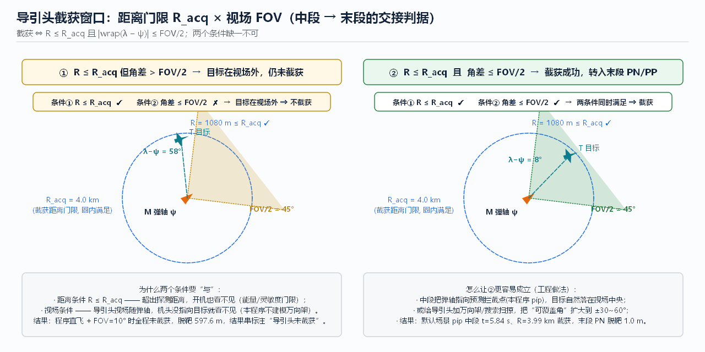

# 07 导引头与目标探测

> **本章回答**：导弹“眼睛”有哪几类、各自凭什么看见目标？
> **搜索 → 截获 → 跟踪**的状态机怎么运转、截获概率怎么算、看见之后怎么被干扰、成像导引头（视觉）如何锁定目标？



---

## 1. 导引头分类（怎么做）

| 类型 | 测什么 | 优点 | 缺点 | 典型定位 |
|------|--------|------|------|----------|
| **半主动雷达** | 目标反射的照射波（`λ、λ̇`） | 弹上无发射机，可连续测速（多普勒） | 依赖照射平台；收发分置几何复杂 | 中程防空 |
| **主动雷达** | 自己发自己收（距离+速度+角度） | 发射后不管、多目标 | 弹上体积/功率/成本高，作用距离受孔径限制 | 中远程末段 |
| **被动雷达（反辐射）** | 目标辐射源（雷达波） | 静默、天然抗干扰（对辐射源） | 只对付开机的雷达；目标静默即失效 | 反雷达 |
| **红外点源** | 目标热辐射能量分布（非成像） | 被动、角分辨率高（像差校正后） | 只给角度不给距离；易被红外诱饵 | 近距格斗 |
| **红外成像（IIR）** | 热像（焦面阵） | 能识别形状、抗诱饵、可选aim点 | 成像处理复杂、成本高 | 现代格斗弹/末段 |
| **可见光/电视** | 可见光图像 | 分辨率高、可识别目标细节 | 依赖光照与天气、夜间失效（或需微光） | 白天/巡飞末段、无人机 |
| **激光（半主动/测距）** | 激光照射回波/测距 | 角精度极高、波束窄抗干扰 | 受烟尘/雨衰影响大、需照射 | 精确制导炸弹 |
| **多模/复合** | 如“雷达+红外”“主动+被动” | 互补抗干扰（单一通道被压制仍可用） | 系统复杂、融合算法要求高 | 现代主战型号 |

**共同的关键参数**：

```
作用距离 R_max  ∝  (发射功率·天线增益·目标RCS)^¼ / (系统噪声·损耗)     （雷达方程）
角分辨率        ∝  λ / D  （波长/孔径）—— 决定能否分辨两个目标、测角精度
视场 FOV        探索覆盖范围 ；  刷新率        跟踪回路带宽与可对付的机动
测角体制        单脉冲（高精度、抗振幅起伏）vs 圆锥扫描/章动（简单、易被干扰）
```

---

## 2. 搜索–截获–跟踪：状态机（怎么做）

```
          开机条件(距离/时机)                    R ≤ R_acq ∧ 角差 ≤ FOV/2
 待机 ─────────────────────► 搜索 ────────────────────────────► 截获判定
                                ▲                                │
                                │  跟踪丢失 / SNR不足 / 角误差超限 │ 通过
                                └────────── 丢失 ◄───────────────┤
                                                                 ▼
                                                              跟踪(输出 λ,λ̇)
                                                                 │
                                                                 ▼
                                                        移交制导律(末段 PN/PP…)
```

- **搜索**：在视场/扫描范围内按预定扫掠图案（螺旋、光栅、扇形）寻找目标，判据是信号超过检测门限 + 持续若干帧；
- **截获**：本仿真简化为“距离∧视场”双条件一次判定（见 [06](06_中段制导与拦截点计算.md) §3）；
  实际还要满足 **SNR 门限** 与 **连续 M 帧确认**（防虚警）；
- **跟踪**：进入闭环测角（单脉冲等），输出 `λ、λ̇`（有 R 的还给 `Vc`），交给末段导引律；
- **丢失/重截**：干扰、目标机动出视场、信噪比跌落 → 回搜索或记忆跟踪（按预测方向短暂外推）。

### 截获概率（结果怎么样，可量化）

```
P_acq = P(R ≤ R_acq) · P(目标 ∈ FOV) · P(SNR ≥ 门限) · P(连续确认) · P(跟踪建立)
```

乘积型结构意味着**任何一项接近 0，整体就接近 0**——这解释了工程上为什么每个环节都要留预算：
中段保证角度项（[06](06_中段制导与拦截点计算.md)）、导引头设计保证距离/SNR 项、算法保证确认与跟踪建立项。

---

## 3. 为什么“看见”本身是难题（为什么）

1. **能量**：主动/半主动依赖回波能量 ∝ 1/R⁴（远一倍，能量少 16 倍）→ 距离门限不是随便定的；
2. **背景**：地面/海面杂波、云层、阳光闪烁——检测要在噪声+杂波里做，门限高了漏、低了虚警；
3. **几何**：视场随弹轴/万向架指向，角速度大的交会（尾追、近距）可能**跟不上**（跟踪带宽 < 目标角速度）；
4. **时间**：搜索时间有限（目标在逼近、可用时间在减少），扫掠覆盖与截获延迟要与中段剩余时间匹配。

---

## 4. 抗干扰与对抗（结果怎么样 / ECM-ECCM）

| 干扰手段 | 原理 | 常见对抗（ECCM） |
|---------|------|-----------------|
| 红外诱饵弹（曳光弹） | 造出更“亮”的红外源 | **成像识别形状**、运动一致性检验、多色（双色比）鉴别 |
| 烟幕/气溶胶 | 衰减激光与可见光 | 多模（雷达接替）、改用毫米波 |
| 压制性噪声干扰 | 抬高噪声底、掩蔽回波 | 频率捷变、超低旁瓣、单脉冲测角、烧穿距离内继续工作 |
| 欺骗性干扰（距离/速度门拖引） | 伪造回波参数把跟踪门“拖走” | 波形分集、多普勒一致性检查、多传感器交叉验证 |
| GNSS 欺骗/压制 | 污染自身位置（[04](04_位置修正_地面与卫星导航.md)） | INS 自主递推 + 雷达链路修正（多源冗余） |

**规律**：单一传感器必然存在“被针对”的弱点，**多模复合 + 多源信息融合**是主流答案——
与 [04](04_位置修正_地面与卫星导航.md)/[05](05_组合导航与状态滤波.md) 里“导航多源冗余”是同一个哲学。

---

## 5. 成像导引头（视觉）：从“检测”到“识别”

### 5.1 处理流水线（怎么做）

```
图像采集 → 预处理(非均匀性校正/滤波) → 检测(候选区域) → 识别(是不是目标) → 跟踪(锁定并输出角误差)
```

- **检测**：阈值分割、形态学、热点/边缘候选；红外焦面还要做**非均匀性校正（NUC）** 与盲元补偿；
- **跟踪算法**（输出给导引律的是**目标在视场中的角位置 → 角误差 → λ̇**）：

| 算法 | 思路 | 优点 | 局限 |
|------|------|------|------|
| 形心跟踪 | 对候选像素求质心 | 简单、实时性极好 | 目标与背景对比度变化、被遮挡即漂 |
| 相关跟踪（匹配） | 与参考模板/上一帧做相关搜索 | 抗局部遮挡、对比度变化 | 计算量大、目标出视场需重捕 |
| 对比度/边缘跟踪 | 沿目标边缘梯度闭环 | 精度高 | 杂波边缘易误跟 |
| 深度学习检测/跟踪 | 学习目标外观特征 | 复杂背景下鲁棒 | 算力、数据依赖、可解释性与对抗脆弱性 🔍 |

- **识别**：分类器/识别网络区分目标与诱饵/背景——这是**抗诱饵的核心**（形状与运动连续性是诱饵最难伪造的）；
- **输出**：把图像平面角误差换算成**视线角误差**，与陀螺稳定平台闭环 → 得到 `λ、λ̇` → 送入 PN/OGL（[08](08_末段导引策略_经典方法.md)）。

### 5.2 为什么用“视觉/成像”

- 分辨率高 → 测角精度高（角误差与目标尺寸成像精度相关）；
- **携带形状信息** → 可识别、可选 aim point（打舰船哪个部位、打飞机哪个部位）；
- 被动 → 不辐射、难被定位；
- 代价：受光照/天气/背景影响，夜间与复杂气象退化 → 所以现代系统倾向**多模**（红外成像 + 毫米波等）。[R02][R10]

---

## 6. 三问小结

- **怎么做**：搜索（扫掠+检测门限）→ 截获（距离∧视场∧SNR∧连续确认）→ 跟踪（测角闭环）→ 输出 `λ、λ̇`。
- **为什么**：制导律的输入**只能**来自导引头（末段）或数据链（中段），所以“探测能力”直接定义了交接窗口与末段精度上限；
- **结果怎么样**：截获是乘积型概率事件（§2），跟踪精度决定脱靶量的“测量误差底”（与 [10](10_工程实践_场景指标与案例.md) 的 σ 合成），
  干扰与对抗决定它在实战中还能剩多少。

---

## 7. 动手实验

1. 默认 `FOV=90°`、`R_acq=4000 m` → `pip` 中段截获（5.84 s / 3.99 km）；
2. `FOV=10°` + 中段=`straight` → 全程未截获；再把 `R_acq` 改到 8000 m（放宽距离条件）→ 仍不截获，
   证明**角度条件是独立的门**；
3. 中段=`pip` + `FOV=10°` → 仍能截获（中段把目标放在视场中央）——体会“用制导换探测余量”的系统思想；
4. 思考：把 `R_acq` 调到 2000 m，`pip` 还会在 3.99 km 截获吗？截获延迟到什么时候？末段起步是否更被动？
   （截获越晚 → 末段初始角误差/时间压力越大 → 脱靶风险上升，可用第 6 节步骤 6 的数据验证。）

---

## 本章文献

- [R02] Siouris, *Missile Guidance and Control Systems*, 2004 —— 各类导引头与雷达方程的系统描述
- [R01] Zarchan（7th ed.）—— 导引头测量模型、测角噪声与制导回路耦合
- [R09] 雷虎民 等 / [R10] 北航《导弹制导控制原理》—— 中文教材的导引头章节
- 🔍 成像跟踪与深度学习跟踪：以 IEEE TIP/TITS、AIAA JGCD 近年综述为入口自行检索
- 上一章：[06 中段制导与拦截点计算](06_中段制导与拦截点计算.md) ｜ 下一章：[08 末段导引策略·经典方法](08_末段导引策略_经典方法.md) ｜ [总目录](README.md)
