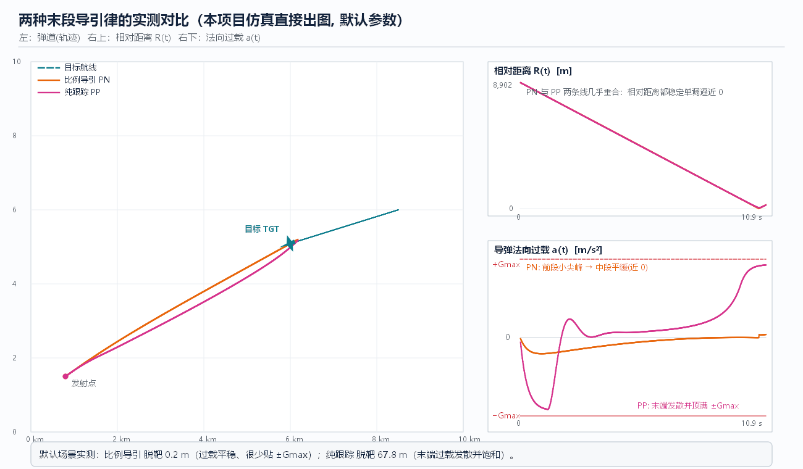

# 08 末段导引策略·经典方法（核心章）

> **本章回答**：导引头截获之后，**用什么公式**把脱靶量压下去？
> 比例导引（PN）怎么推导、导航比怎么选；纯跟踪（PP）为什么便宜却危险；
> 增广 PN、落角约束、最优制导（OGL）分别解决什么问题；执行机构与过载饱和怎么毁掉一切。



---

## 1. 比例导引 PN（Proportional Navigation）

### 1.1 定义（怎么做）

```
让导弹速度矢量的转动率  ∝  视线的转动率:

    ψ̇  =  N · λ̇                      (N: 导航比, 常用 3~5, 教学默认 N = 4)

工程实现（以法向过载为执行量）:

    a_cmd  =  N · Vc · λ̇              (Vc = Ṙ < 0 为接近速度)
```

**测量**：`λ̇` 来自导引头测角微分（或单脉冲角误差 × 跟踪回路）；`Vc` 来自多普勒/距离微分（无距离测量时用估计值）。

### 1.2 为什么有效（几何直觉 + 数学）

- **几何直觉**：`λ̇ = 0` ⇔ 视线不转 ⇔ 双方已在**碰撞航线**上（相对速度沿视线方向）。
  PN 的目标就是**把 `λ̇` 驱动到 0**——一旦为 0，只要不机动，必然相遇（[R03]）。
- **数学**：设相对距离 `R`、视线角 `λ`，横向相对速度 `V_θ = R·λ̇`。PN 使导弹横向速度跟踪 `N` 倍的视线转率，
  可证明在常值 `Vc` 下 `λ̇` 按 `R^(N−2)` 衰减：
  - `N > 2`：`λ̇ → 0`（收敛，越到末段越平缓）；
  - `N = 2`：`λ̇` 不衰减（临界）；
  - `N < 2`：`λ̇` 发散（末端过载爆炸）。
  **这就是“N 至少要大于 2”的由来**（[R01][R06] 给出闭式分析）。
- **收敛的另一面**：`N` 越大对 `λ̇` 的响应越强 → 对**测量噪声**（导引头角噪声）越敏感，
  末端噪声引起的过载抖动越大 → 选择 `N` 是“收敛快 vs 抗噪好”的权衡（经典区间 3~5，[R01]）。

### 1.3 结果怎么样（本仿真实测，默认参数）

| 指标 | 比例导引 PN | 纯跟踪 PP |
|------|------------|-----------|
| 脱靶量 | **0.2 m** | **67.8 m**（> 杀伤半径 25 m → 判定脱靶） |
| 过载曲线 | 前段小尖峰 → 中段近 0 → 末端平稳 | 早期大幅摆动 + **末端发散并顶满 ±Gmax** |
| 对 `λ̇` 的依赖 | 直接闭环 `λ̇→0` | 无（只对准当前位置） |
| 对测量噪声 | 敏感（N 越大越敏感） | 不敏感（不测 `λ̇`） |
| 实现成本 | 需 `λ̇` 与 `Vc` | 只需指向角（最便宜） |

图 fig06 左：两者弹道几乎重合（**都朝相遇区域飞**）；右下：过载差异才是本质——
PP 把误差积压到最后，靠“饱和硬掰”，PN 把误差提前慢慢消化。

---

## 2. 变体：各自解决什么问题

### 2.1 真实比例导引 TPN / 增广 APN

| 名称 | 公式（要点） | 解决什么 |
|------|-------------|---------|
| **TPN**（真 PN） | 指令沿**弹道法向**（垂直于弹速）施加 | 教学/分析方便，与执行机构方向一致 |
| **PPN**（纯 PN） | 速度矢量转动率 ∝ `λ̇`（沿速度方向） | 理论分析（[R06]） |
| **APN**（增广 PN） | `a = N·Vc·λ̇ + N/2 · a_T_⊥`（补上**目标法向机动**项） | 目标机动时消除稳态滞后——把“目标在转弯”作为已知输入前馈 |
| 考虑重力/气动 | 指令中抵消重力项与过载-舵偏非线性 | 掉高度、执行非线性 |

**为什么 APN 有效**：PN 只对 `λ̇` 反应，目标机动会让 `λ̇` 存在**稳态偏差**（永远差一点）；
APN 把目标加速度作为前馈项直接补上 → 稳态偏差降为零（前提：目标机动估计要准，[R01][R03]）。

### 2.2 纯跟踪 PP（Pure Pursuit / 瞄准法）

- **怎么做**：`ψ ← λ`（始终指向目标当前位置），等价于把相对横向速度清零。
- **为什么便宜**：不需要 `λ̇`，只需“目标在哪个方向”——最简单的寻的律（甚至可用波束/视线直接实现）。
- **为什么危险（结果）**：它**永远不解决提前量**——目标在动，导弹始终朝“旧位置”追，
  误差被拖到末段集中爆发，所需过载随 `t_go → 0` 发散（几何上：尾追时 `λ` 变化率在末端趋于极端）。
  本仿真实测脱靶 **67.8 m**、末端过载**饱和**（图 fig06 右下粉色曲线）。
- **什么时候还能用**：接近速度大、目标几乎不动或正对头（`λ` 变化小）的场合——本质是“没得选时的降级方案”。[R01][R04]

### 2.3 迭代制导 / 时间约束（IPN、角度-时间控制）

- **背景**：多弹同时到达（salvo）、或要求在特定时刻命中（配合引信/协同）。
- **做法**：用迭代解出的 TOF/剩余时间修正指令（把 `t_go` 估计误差也纳入闭环），或直接对时间误差做反馈。
- **结果**：时间精度可到亚秒级（取决于 TOF 估计与速度控制精度）。[R11]（角度控制与时间控制导引律，中文专著）

### 2.4 最优制导 OGL（Optimal Guidance Law）

- **怎么做**：把制导写成**最优控制问题**——最小化 `J = ∫ a² dt + W·(终端脱靶量)²`，
  用极小值原理/两点边值问题求解 → 得到形如 `a = N_eff(t_go)·ZEM/t_go²` 的时变导航比制导律。[R23]
- **为什么**：PN 的常值 `N` 是“近似最优”；OGL 明确给出**随剩余时间变化的有效导航比**，
  在执行机构有滞后/带宽限制时，会自动**提前**发力（滞后系统需要更大前置增益补偿相位）。
- **结果**：同等过载限制下脱靶量更小，或同等脱靶量下过载需求更低；代价是依赖 `t_go` 估计与模型精度。[R01][R05]

### 2.5 落角约束 / 偏置 PN（Biased PN）

- **问题**：攻顶破甲需要大落角、打击舰面需要特定着角——“打中”不够，还要“**从哪个方向打**”。
- **做法**：
  1. **偏置法**：在 PN 指令上叠加一个偏置项 `b(t)`，使视线被“顶”向期望方向（简单、工程常用）；
  2. **时间域 OGL / 落角约束解**：给终端角误差一个权重，解出闭式时变指令（需 `t_go`）；
  3. **滑模/预测校正**：对模型不确定性鲁棒（[09](09_末段导引策略_现代与智能方法.md)）。
- **结果**：可在脱靶量几乎不变的情况下把落角控制到数度内；代价是**过载预算被落角占用**，
  `N` 与偏置强度要在“命中”与“落角”之间分配（[R11][R12] 有系统的中文推导）。[R01]

---

## 3. 执行机构：从指令到真实过载（决定成败的一半）

```
a_cmd ──► [一阶滞后: τ da/dt = a_act − a_cmd] ──► [限幅: |a_act| ≤ Gmax] ──► 真实弹道
                    (舵机/弹体动力学)                    (结构/气动极限)
```

- **滞后 τ**：等效把闭环时间常数加大 → 若 `t_go` 接近 `τ` 的数倍，控制来不及 → 脱靶急剧增大；
- **限幅 Gmax**：**过载饱和是最常见的失败模式**——饱和后 `λ̇` 无法继续收敛，
  误差在饱和期间自由增长，等到脱饱和时已经来不及（这正是图 fig06 中 PP 的末端曲线“顶满 ±Gmax”）；
- **速率限制**：舵偏速率受限会让大机动起不来（比幅值限制更早出现）；
- **工程含义**：过载余量 = 末段的“救命储备”。**中段把目标送进视场中央**（[06](06_中段制导与拦截点计算.md)），
  本质就是在给末段省过载；这也是“中段收敛质量决定末段成败”的物理机制。

**可用过载 vs 需求过载的直觉**（几何估计）：

```
末端所需过载  ≈  N · Vc · |λ̇| ， 且 λ̇ 随 t_go 收敛；横向偏移 e 需要的过载 ~ e / t_go²
→ 偏差越晚发现，过载需求按 1/t_go² 爆炸（“最后 1 秒修正 100 m 需要的过载”远超想象）
```

---

## 4. 经典方法横向对比（速查表）

| 导引律 | 需要的测量 | 优点 | 缺点 | 适用 |
|--------|-----------|------|------|------|
| **PN** | `λ̇, Vc` | 结构简单、脱靶小、末端平缓 | 对噪声敏感；目标机动有稳态滞后 | **通用主流** |
| **APN** | `λ̇, Vc, a_T` | 消除机动目标滞后 | 需目标机动估计 | 高机动目标 |
| **PP** | 指向角 | 最简单、抗噪 | 末端过载发散、脱靶大 | 降级/低动态 |
| **IPN/时间制导** | + TOF/时间 | 时间可控（协同） | 依赖 TOF 估计 | 多弹协同 |
| **OGL** | + `t_go`、模型 | 过载最优、可带滞后补偿 | 依赖模型与 `t_go` | 过载受限/滞后大 |
| **落角约束（偏置/时变）** | + 期望落角 | 打击方向可控 | 占用过载预算 | 攻顶/侵彻 |

---

## 5. 程序实现对照（`guidance_sim`）

| 概念 | 代码 | 说明 |
|------|------|------|
| PN 指令 | `guidance.py → guidance_command("pn", …)` | `a = N·Vc·λ̇`，`N = N_DEFAULT = 4` |
| PP 指令 | 同上 `"pp"` | 指向目标当前位置（对应 §2.2） |
| 执行机构 | 一阶滞后 `τ = 0.25 s` + `±Gmax` 限幅 | 对应 §3（参数面板可调） |
| 终止判定 | `simulation.py`：`R ≤ R_hit(25 m)` 或超时/越界 | 脱靶量按“点到线段”精确计算 |
| 指标输出 | 结果串、数据表（`missed by … m`、`overload` 峰值） | 用于 [10](10_工程实践_场景指标与案例.md) 指标统计 |

---

## 6. 动手实验（改参数看机理）

1. **基线**：默认参数，记录 PN 脱靶 **0.2 m**、PP **67.8 m**，并观察图示过载曲线差异（或按 `S` 快照）。
2. **调导航比**：`N=2.1` → `N=4` → `N=8`，分别记 PN 脱靶与过载峰值：
   - `N` 偏小 → 末端收敛慢、脱靶增大；
   - `N` 偏大 → 起段过载尖峰变大、对噪声更敏感（可在代码里给 `λ̇` 加噪声再试）。
3. **调执行机构**：把 `τ` 从 0.25 s 增到 1.0 s → 脱靶如何变化？（滞后吃掉相位裕度的直接演示）
4. **调限幅**：把 `Gmax` 从 10 G 降到 3 G → 哪条律先崩？（提示：PP 先饱和崩溃，见图 fig06）
5. **加高机动目标**：目标 `turn_rate` 调大 → PN 出现稳态滞后 → 对照 §2.1 思考 APN 会怎么补（本程序未实现 APN，属留白思考题）。
6. **尾追几何**：把目标初始航向改为**背离**导弹（尾追），观察 `λ̇` 与过载的末端行为，体会“前置量被拖爆”。

---

## 7. 本章 FAQ

**Q1：`λ̇` 哪来的？直接测得吗？**
不是“直接测”。导引头测的是**目标相对弹轴的角误差**，跟踪回路把它变成角速度估计（或对 `λ` 差分），
再经滤波（[05](05_组合导航与状态滤波.md)）。所以 `λ̇` 带噪声——这是 PN 要权衡 `N` 的根本原因。

**Q2：为什么 PP 在“尾追”时最容易失败？**
尾追时前置角需求最大（要绕到目标前方），而 PP 恰恰**不产生前置量**，误差全部堆到 `t_go→0`，
按 `1/t_go²` 需要的过载必然超限 → 脱靶甚至“擦肩而过”。

**Q3：脱靶量 67.8 m 算“完全失败”吗？**
看杀伤半径：`R_hit = 25 m` 时 67.8 m 明显失败；若战斗部杀伤半径 100 m（如大威力破片）则可能仍有杀伤概率——
指标永远要成套看（脱靶量、CEP、杀伤半径、引信），见 [10](10_工程实践_场景指标与案例.md)。

**Q4：`λ̇` 很小时 PN 还需要工作吗？**
`λ̇≈0` 表示已在碰撞航线，`a_cmd≈0`——这正是 PN 的优点：**它会自己“闲下来”**，不浪费过载；
而 PP 即使在碰撞航线上也会持续微调（因为始终对准“当前位置”而非“相遇点”）。

**Q5：末段还要不要继续解拦截点？**
不需要显式解——PN 本身就是“用视线转率表达的拦截点解算”。两者是**同一目标的两种表达**：
几何解（PIP）适合中段无 `λ̇` 测量时用，反馈解（`λ̇`）适合末段有测量时用（[06](06_中段制导与拦截点计算.md)）。

---

## 本章文献

- [R01] Zarchan（7th ed.）—— PN/APN/OGL/落角与饱和分析的权威推导与数值结论
- [R03] Palumbo et al. 2010 —— `λ̇→0` 收敛性与工程注解（短、准）
- [R06] Guelman 1971 —— PN 闭式/定性分析
- [R04] Garnell —— 执行机构与制导回路的经典工程视角
- [R11] 张友安《角度控制与时间控制导引律》｜ [R12] 王辉 等《战术导弹制导律设计理论与方法》—— 落角/时间约束的中文系统推导
- [R05] Yanushevsky, *Modern Missile Guidance* —— 各类导引律横向比较
- 上一章：[07 导引头与目标探测](07_导引头与目标探测.md) ｜ 下一章：[09 末段导引策略·现代与智能方法](09_末段导引策略_现代与智能方法.md) ｜ [总目录](README.md)
