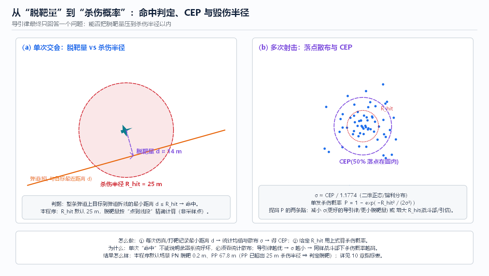

# 10 工程实践：场景·指标·案例

> **本章回答**：一套制导方案好不好，**用什么指标**衡量？不同**交会几何**为什么会难易不同？
> 参数怎么调、问题怎么查——把前 9 章的知识收敛成**可执行的工程清单**。



---

## 1. 交会几何：为什么“尾追难、迎头易”

### 1.1 三种典型几何

| 场景 | 特征 | 难点 | 结果趋势 |
|------|------|------|---------|
| **迎头** | 相对接近快（`Vc ≈ Vm + Vt`） | 时间短、`λ̇` 大 | 交会快、前置角小；但 TOF 短 → 对反应与测量延迟极敏感 |
| **侧向（横向）** | `Vt` 垂直于视线 | 前置角最大（要“绕前”） | 对可用过载要求高；图 fig02 即此类示意 |
| **尾追** | `Vt` 背离、接近慢 | `λ̇` 末端急剧变化、前置量最大 | **最容易过载饱和与脱靶**（PP 尤甚，见 [08](08_末段导引策略_经典方法.md)） |

### 1.2 三条可推导的规律（为什么）

1. **前置角** `φ = asin(Vt·sin qt / Vm)`：`Vt/Vm` 越大、`qt` 越接近 90°，前置角越大 → 要求中段更早收敛（[06](06_中段制导与拦截点计算.md)）；
2. **修正贵贱**：横向偏差 `e` 需要的过载 `≈ e / t_go²` —— “晚发现 1 秒 = 贵 4 倍（对比 2 秒前发现）”；
3. **能量**：`a_cmd = N·Vc·λ̇` 中 `Vc` 是资源也是负担——`Vc` 大则单位 `λ̇` 需要更大过载，但 `Vc` 大也意味着 TOF 短、可用机动时间短。
   **结论**：好打的场景 = “接近速度适中 + 前置角可提前消化 + 末端有速度余量”。[R01][R03]

---

## 2. 指标体系（必须成套看）

### 2.1 单发指标

| 指标 | 定义 | 怎么得到 | 门限参考 |
|------|------|---------|---------|
| **脱靶量 d** | 弹道与目标的最小距离（本程序按点到线段精确计算） | 每次仿真/打靶记录 | 应 ≤ 杀伤半径 `R_hit` |
| **截获概率 P_acq** | 进入跟踪的比例 | 统计“截获判据满足率” | 乘积分解见 [07](07_导引头与目标探测.md) §2 |
| **过载峰值/饱和率** | `max|a|` 与顶限时间占比 | 数据表/曲线 | 留 ≥ 1.5~2× 余量对付目标机动 |
| **落角误差** | 实际着角 vs 期望 | 几何计算 | 视战斗部需求 |
| **时间误差** | 实际 vs 期望到达 | 协同场景 | 协同用 |

### 2.2 统计指标（多次/多样本）

```
σ(脱靶量) → CEP ≈ 1.1774·σ   （二维正态/瑞利: 50% 落点在 CEP 圆内）
单发杀伤概率  P_k = 1 − exp( −R_hit² / (2σ²) )      σ = CEP / 1.1774
提高 P_k 的两条路:  减小 σ（更好的估计+制导）   或   增大 R_hit（战斗部/引信）
```

**注意陷阱**：
- **平均脱靶量会骗人**——10 次里 9 次 1 m、1 次 500 m，均值只有 50 m，但**单发可用性**极差；
  所以报 P95/最大值、报**成功概率**，别只报均值；
- **CEP 与杀伤半径必须配套**：`R_hit/CEP ≥ 1` 时 `P_k` 才好看（代入上式即可算出预期值）。[R09]

### 2.3 本仿真默认场景的实测基线

| 配置 | 截获 | 脱靶 | 结论 |
|------|------|------|------|
| 不分段（纯末段 PN） | — | **0.2 m** | 理想基准 |
| 不分段（纯末段 PP） | — | **67.8 m** | 超 `R_hit=25 m` → 脱靶 |
| 分段 `pip` + PN | 5.84 s / 3.99 km | **1.0 m** | 中段把目标送进视场中央 |
| 分段 `straight` + FOV 10° | **未截获** | ~597 m | 失去末段测量 → 失效 |

（可用 `python selftest.py` 一键复现这组基线。）

---

## 3. 参数表与调参建议

| 参数 | 默认 | 影响 | 调参方向 |
|------|------|------|---------|
| 导航比 `N` | 4 | 收敛速度 vs 噪声敏感 | 3~5 起步；有测量噪声别往 8 调 |
| 舵机时间常数 `τ` | 0.25 s | 闭环滞后 | 增大 → 脱靶急剧上升（模型保真度问题） |
| 过载限幅 `Gmax` | 10 G | 末端可用机动 | 与目标机动能力对比取 1.5~2× |
| 截获距离 `R_acq` | 4000 m | 交接早晚 | 越早交接越从容，但受导引头实际作用距离约束 |
| 视场 `FOV` | 90° | 截获难易 vs 跟踪质量 | 角误差预算 ≤ FOV/4~FOV/6（[06](06_中段制导与拦截点计算.md)） |
| 中段方式 | `pip` / `straight` | 是否主动送入视场 | 任何有目标信息的场合都应 `pip` |
| 仿真步长 `dt` | 0.05 s | 数值精度 | 校验：把 `dt` 减半，脱靶量应基本不变 |

---

## 4. 案例视角（公开信息层面的定性归纳）

> **声明**：以下为公开教材/资料中常见的**体制归纳**，不含具体型号性能数字；
> 任何型号的具体指标请以官方公开资料为准（📖 见 [R01][R09][R10] 的综述章节）。

| 交战类型 | 常见体制组合 | 对应本资料章节 |
|---------|-------------|----------------|
| 中远程防空 | 惯导+卫星中段、数据链指令修正、末段主动雷达寻的 | 02 / 04 / 06 / 07 |
| 近程点防御 | 指令/驾束全程、或半主动末段；强调反应时间与截获概率 | 02 / 07 |
| 机载格斗 | 红外成像导引头、大离轴发射、落角/过载极限优化 | 07 / 08 / 09 |
| 反舰/对地 | 中段惯导+GNSS+地形/景象匹配、末段成像+落角控制 | 03 / 04 / 07 / 09 |
| 反雷达 | 被动导引头、目标辐射为唯一信息源 | 07 |

**共性结论**（贯穿全书）：
1. **多源信息 + 分段交接**是所有体制的共同结构（01/02/04/06）；
2. 末段永远回到 **PN 及其变体**（08）——先进方法多是对它的补丁（09）；
3. 最终胜负由**误差预算**决定：测量噪声 + 估计误差 + 执行滞后 + 过载余量 → 脱靶量 σ → 杀伤概率（本章）。

---

## 5. 排错清单（仿真/实装通用）

**现象 → 最可能的原因 → 怎么查**

| 现象 | 可能原因 | 检查动作 |
|------|---------|---------|
| 脱靶大、过载曲线末端爆表 | 误差积压到末段（`t_go` 太小才发现） | 看中段是否 `pip`、截获时刻是否过晚 |
| 过载始终顶限（平台期） | `Gmax` 不足 / 目标机动过强 / `N` 过大 | 降 `N`、检查 `Gmax` 与目标 `turn_rate` |
| 脱靶对 `dt` 敏感 | 数值积分精度不够 | `dt` 减半做收敛性验证 |
| 结果串出现“导引头未截获” | 角度条件不满足 / `R_acq` 不足 | 看 FOV、中段方式（[06](06_中段制导与拦截点计算.md) 实验 3） |
| 改参数后“结果没变” | 参数没写回配置（改了 UI 没应用/未点确认） | 重跑 `selftest.py` 或检查面板写入 |
| PN 起段就有大尖峰 | 初始 `λ̇` 就很大（中段交接没做好）或 `N` 过大 | 检查中段收敛质量、初始几何 |
| PP 看似“更稳” | 它只是**不响应** `λ̇`，误差被藏进末端 | 看末端过载与最终脱靶，不要看曲线平滑度 |

**验证三板斧**：
1. `python selftest.py`（12 个场景的回归基线，含截获列）；
2. `python gui_test.py`（界面与文档渲染断言）；
3. 手动跑本资料各章「动手实验」，用 `S` 快照留存对比。

---

## 6. 全书总 FAQ（Top 10）

1. **中段为什么不能用 PN？** 没有 `λ̇` 测量（导引头未截获）；只能用几何预测（PIP/ZEM）做“伪视线”反馈（[06](06_中段制导与拦截点计算.md)）。
2. **路径规划和拦截点算的是同一件事吗？** 不是：一个解“路”，一个解“时刻+交会点”，时间尺度与输入完全不同（[03](03_路径规划与航迹生成.md)）。
3. **GNSS 能不能替代数据链？** 不能：GNSS 只给“我在哪”，目标状态必须来自探测+链路（[04](04_位置修正_地面与卫星导航.md)）。
4. **卡尔曼滤波为什么“最优”？** 线性高斯下最小方差无偏；前提不成立时就不优——所以要 Q/R 标定与一致性检验（[05](05_组合导航与状态滤波.md)）。
5. **截获到底看几个条件？** 至少两个：距离 ∧ 视场；工程上还要加 SNR 与连续确认（[06](06_中段制导与拦截点计算.md)/[07](07_导引头与目标探测.md)）。
6. **N 越大越好吗？** 不是：N 大收敛快但噪声放大、起段过载大；常用 3~5（[08](08_末段导引策略_经典方法.md)）。
7. **PP 什么时候能用？** 目标低动态或作为降级方案；高速机动目标下会末端饱和（本仿真实测 67.8 m）。
8. **先进制导律一定比 PN 好吗？** 先升级估计器再谈制导律；默认“PN + 好估计”已覆盖多数场景（[09](09_末段导引策略_现代与智能方法.md) 决策树）。
9. **脱靶 67 m 算失败吗？** 取决于 `R_hit`；指标必须成套（脱靶/CEP/引信/杀伤半径）（本章 §2）。
10. **怎么证明我的改动没破坏原功能？** 跑 `selftest.py` 与 `gui_test.py`，看基线数字是否一致。

---

## 7. 学习与查证建议（收尾）

1. **先通读 01 建立框架**，再按 [总阅读路线](README.md) 选一条深入；不要从单章“公式”开始（容易丢失物理图景）。
2. **每个公式都回答三问**：怎么做（推导/流程）、为什么（物理/工程动机）、结果（定量结论+失效模式）——本资料每章按此组织，你自己的笔记也建议照此写。
3. **用仿真验证直觉**：本资料所有带数字的结论都可在 `guidance_sim` 复现；改变一个参数、只观察一个现象，是最好的学习法。
4. **引用要核对**：[总目录](README.md) 中 ✅ 条目已核实出处；📖 条目请在正式引用前核对卷期页码；🔍 方向请以最新检索为准。

---

## 本章文献

- [R01] Zarchan（7th ed.）—— 交会几何、饱和分析与统计结论
- [R03] Palumbo et al. 2010 —— 工程视角的制导回路性能权衡
- [R09] 雷虎民 等 / [R10] 北航《导弹制导控制原理》—— 中文工程教材的指标与体制描述
- [R15] Bar-Shalom et al. —— 统计指标与估计一致性（NIS 等）
- 上一章：[09 末段导引策略·现代与智能方法](09_末段导引策略_现代与智能方法.md) ｜ 返回 [总目录](README.md)
